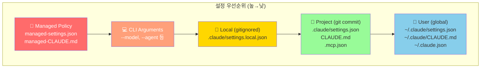
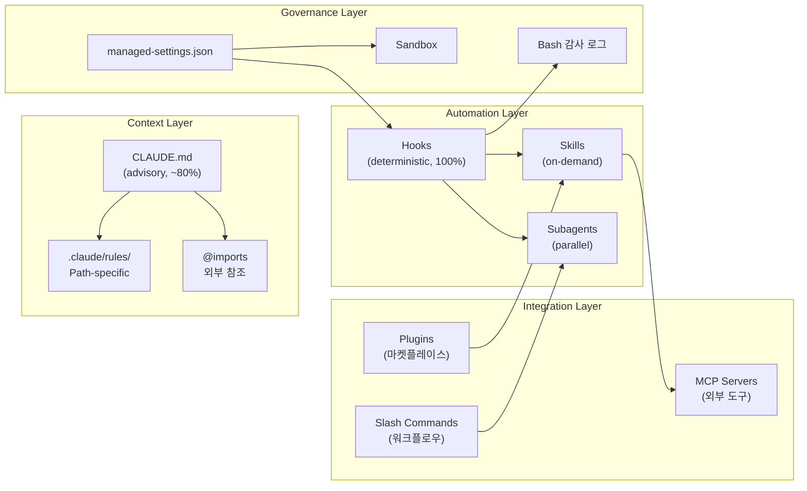
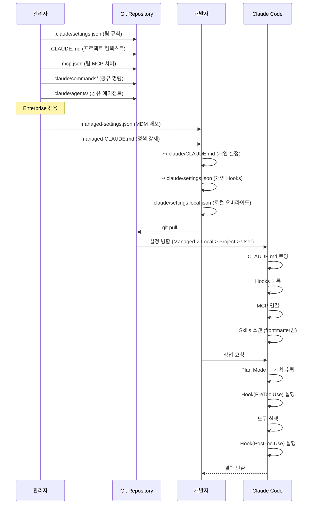
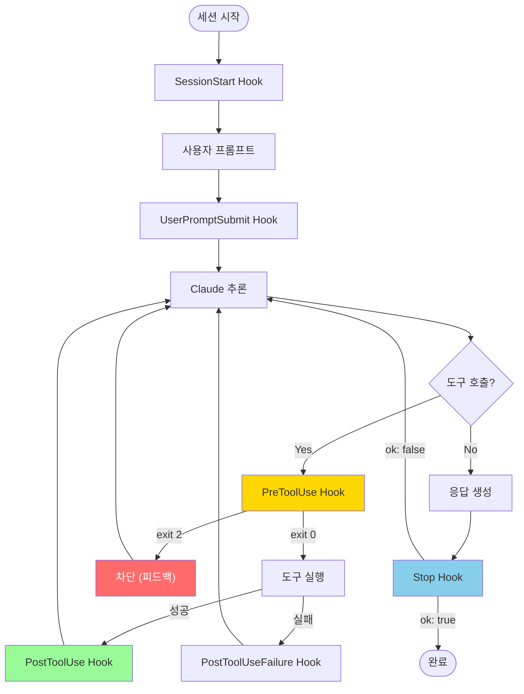
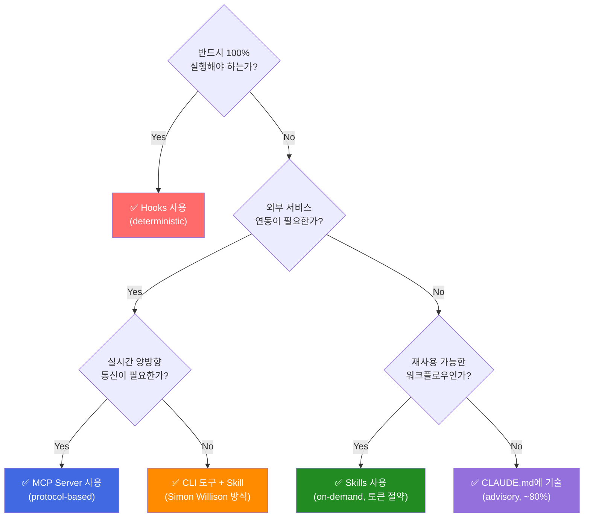

# Claude Code 하네스 구성 리서치 — Top 10 개발자 조사

| 항목 | 내용 |
|------|------|
| 조사일 | 2026-04-02 |
| 작업자 | 전여철 + Claude Opus 4.6 |
| 범위 | 해외 7명 + 국내 3명, 하네스 설정 + 워크플로우 + 팀 운영/거버넌스 |

---

## 목차

1. [조사 개요](#1-조사-개요)
2. [해외 개발자 7명](#2-해외-개발자-7명)
3. [국내 개발자 3명](#3-국내-개발자-3명)
4. [공식 Best Practices (Anthropic)](#4-공식-best-practices-anthropic)
5. [종합 비교 매트릭스](#5-종합-비교-매트릭스)
6. [하네스 아키텍처 도식](#6-하네스-아키텍처-도식)
7. [핵심 인사이트 및 시사점](#7-핵심-인사이트-및-시사점)
8. [Sources](#8-sources)

---

## 1. 조사 개요

### 선정 기준

- 2026년 4월 기준 Claude Code 하네스 구성을 **공개적으로 공유**한 개발자
- 실제 설정 파일(CLAUDE.md, settings.json, hooks 등)을 포함한 경우 우선
- 해외 7명 : 국내 3명 비율

### 공개 수준 분류

| 수준 | 설명 | 해당 인원 |
|:---:|------|----------|
| A | 설정 파일 전체 공개 (GitHub repo) | Trail of Bits, feiskyer, 황민호 |
| B | 주요 설정 + 워크플로우 공개 | Boris Cherny, rhcwlq89, Builder.io |
| C | 원칙/철학 위주, 설정 일부 공유 | Addy Osmani, Simon Willison, 강현구 |
| D | 교육/가이드 중심, 구체 설정 비공개 | Kent C. Dodds, Wes Bos |

---

## 2. 해외 개발자 7명

### 2-1. Trail of Bits — 보안 중심 구성 [공개 수준: A]

> GitHub: [trailofbits/claude-code-config](https://github.com/trailofbits/claude-code-config)

**핵심 철학**: Defense-in-depth, 보안 우선

가장 포괄적인 오픈소스 구성. settings.json, CLAUDE.md 템플릿, hooks, commands, statusline 모두 공개.

**settings.json — 핵심 구성**

Deny 규칙 (Credential 보호):
```
~/.ssh/**                    # SSH 키
~/.gnupg/**                  # GPG 키
~/.aws/**, ~/.azure/**, ~/.kube/**  # 클라우드 자격증명
~/.npmrc, ~/.pypirc, ~/.gem/credentials  # 패키지 레지스트리 토큰
~/.git-credentials, ~/.config/gh/**  # Git 자격증명
~/.bashrc, ~/.zshrc          # 셸 설정 (편집 차단)
~/Library/Keychains/**       # macOS 키체인
```

파괴적 명령 차단: `rm -rf`, `sudo`, `mkfs`, `dd`, `git push --force` to main/master

**Hooks 구성**

PreToolUse — rm -rf 차단:
```bash
jq -r '.tool_input.command' | grep -E "rm\s+-.*rf" && exit 2 || exit 0
```

PreToolUse — main 직접 push 차단:
```bash
jq -r '.tool_input.command' | grep -E "push.*main|push.*master" && exit 2 || exit 0
```

PostToolUse — Bash 감사 로그:
```json
{
  "PostToolUse": [{
    "matcher": "Bash",
    "hooks": [{
      "type": "command",
      "command": "jq -r '[' + (now | todate) + '] ' + .tool_input.command' >> ~/.claude/bash-commands.log"
    }]
  }]
}
```

Stop — Anti-rationalization gate:
```json
{
  "Stop": [{
    "hooks": [{
      "type": "prompt",
      "prompt": "Reject if assistant rationalizes incomplete work: claiming 'pre-existing' issues, 'out of scope', deferring to follow-ups. Respond JSON-only: {\"ok\": false, \"reason\": \"...\"} or {\"ok\": true}"
    }]
  }]
}
```

**CLAUDE.md 템플릿 핵심 원칙**

- "No speculative features" — 사용자가 요구할 때까지 기능 추가 금지
- "No premature abstraction" — 3회 반복 후에만 패턴화
- "Replace, don't deprecate" — 이중 경로 유지 금지
- "Verify at every level" — 자동화 가드레일 우선

**Code Quality Hard Limits**

| 항목 | 제한 |
|------|------|
| 함수 길이 | ≤100줄 |
| Cyclomatic complexity | ≤8 |
| 파라미터 수 | ≤5 positional |
| 줄 길이 | 100자 |
| Import | Absolute only (`..` 금지) |

**언어별 도구 체인**

| 언어 | 의존성 | 린팅 | 타입체크 | 테스트 |
|------|--------|------|----------|--------|
| Python 3.13 | uv | ruff | ty | pytest |
| Node/TS 22 | pnpm | oxlint | TS strict | vitest |
| Rust (stable) | cargo | clippy strict | — | cargo test + cargo-mutants |
| Bash | — | shellcheck + shfmt | — | — |

**마켓플레이스 & Skills**

```bash
claude plugin marketplace add trailofbits/skills          # 공개 보안 감사
claude plugin marketplace add trailofbits/skills-internal  # 사내 전용
claude plugin marketplace add trailofbits/skills-curated   # 검증된 서드파티
```

**MCP 서버**: Context7 (라이브러리 문서), Exa (웹/코드 검색)

**Slash Commands**: `/review-pr`, `/fix-issue`, `/merge-dependabot`, `/trailofbits:config`

**Sandboxing**: `/sandbox` 내장 모드 + Devcontainer (`trailofbits/claude-code-devcontainer`)

---

### 2-2. Boris Cherny — Claude Code 창시자 [공개 수준: B]

> Site: [howborisusesclaudecode.com](https://howborisusesclaudecode.com/)

**핵심 철학**: "놀라울 정도로 바닐라 설정"

- Claude Code는 out of the box로 충분 → 과도한 커스터마이징 불필요
- Plan 모드 우선: Shift+Tab 두 번 → 계획 검토 → 승인 후 auto-accept
- Opus 모델 + thinking mode를 **모든 작업**에 사용

**병렬 실행 전략**

- 터미널 5개 Claude 동시 실행 (탭 1~5 넘버링)
- claude.ai/code에서 5~10개 추가 병렬 실행
- **Git worktree** 기반 격리: `claude --worktree my_worktree`
- iTerm2 시스템 알림으로 세션 완료/입력 필요 시 ping

**CLAUDE.md 전략**

- 팀 공유 단일 파일, git 커밋
- 팀 전체가 주 수회 업데이트
- PR 코멘트에 `@.claude` 태그로 자동 학습 추가
- 예시: `"Always use bun, not npm"`, typecheck → test → lint 순서

**Settings & Permissions**

```
Bash(bun run *)    — 사전 허용
Bash(test:*)       — 사전 허용
```

**Hooks**

| Event | 용도 |
|-------|------|
| PostToolUse | `bun run format \|\| true` (자동 포맷팅) |
| SessionStart | 동적 컨텍스트 로딩 |
| Stop | 장기 실행 작업 관리 |

**MCP Servers**

| 서버 | 용도 |
|------|------|
| Slack | `http://slack.mcp.anthropic.com/mcp` |
| BigQuery CLI | 데이터 접근 |
| Sentry | 에러 로그 통합 |

**Slash Commands** (`.claude/commands/`, git 커밋)

- `/commit-push-pr` — 커밋→PR 자동화
- `/simplify` — 병렬 품질 개선 에이전트
- `/batch` — worktree 간 코드 마이그레이션
- `/loop` — 최대 3일 반복 작업
- `/schedule` — 클라우드 스케줄 작업

**Subagents** (`.claude/agents/`)

`code-simplifier.md`, `verify-app.md`, `build-validator.md`, `code-architect.md`, `oncall-guide.md`

**터미널 환경**

- Ghostty 에디터 (동기화 렌더링, 24-bit 컬러)
- Statusline: 모델, 디렉토리, 컨텍스트%, 비용, 경과 시간
- 음성 딕테이션: macOS fn×2 ("3배 빠른 프롬프팅")
- `/color`로 병렬 세션 색상 구분
- `--teleport`으로 모바일/웹/데스크톱 간 세션 이동

---

### 2-3. Addy Osmani — Google [공개 수준: C]

> Blog: [addyosmani.com/blog/agents-md/](https://addyosmani.com/blog/agents-md/)

**핵심 철학**: "지뢰밭 경고만 제공하라"

- AGENTS.md/CLAUDE.md는 "아직 고치지 못한 코드베이스 냄새 목록"이지, 영구 설정이 아님
- `/init` 자동 생성 **강력 반대** — LLM 생성 컨텍스트 파일은 성공률 2~3% 하락, 비용 20%+ 증가
- 모든 줄은 "에이전트가 코드에서 스스로 발견할 수 없는 정보"만 포함해야 함

**CLAUDE.md 포함/제외 기준**

| 포함 (비발견 정보) | 제외 (에이전트가 알아낼 수 있음) |
|---|---|
| `uv`로 패키지 관리 | 디렉토리 구조 설명 |
| `--no-cache` 필수 (fixtures 관련) | 기술 스택 설명 |
| auth 모듈 커스텀 미들웨어 | 모듈 역할 설명 |
| `legacy/` 삭제 금지 (3개 모듈 의존) | 아키텍처 요약 |

**아키텍처 제안: 계층적 동적 로딩**

1. **Protocol file**: 최소 라우팅 문서
2. **Focused persona/skill files**: 작업 유형별 선택 로딩
3. **Maintenance subagent**: 코드베이스 진화에 맞춰 컨텍스트 자동 업데이트

**Agent Teams / Multi-Agent 연구**

- O'Reilly CodeCon 2026 발표: "Orchestrating Coding Agents"
- Self-Improving Agents 블로그 — 에이전트가 자체 AGENTS.md를 개선하는 패턴
- CLAUDE.md vs AGENTS.md 구분: 여러 AI 도구 사용 시 AGENTS.md에 공통 규칙, CLAUDE.md에 Claude 전용

---

### 2-4. Builder.io / Steve Sewell — 교육 중심 [공개 수준: B]

> Blog: [builder.io/blog](https://www.builder.io/blog/claude-md-guide)

**핵심 철학**: CLAUDE.md 작성법 체계화, 교육적 콘텐츠 생산

50+ 팁, CLAUDE.md 작성법, MCP 가이드 등 Claude Code 관련 블로그를 가장 체계적으로 시리즈 발행.

**주요 블로그 시리즈 (7편+)**

1. "How to Write a Good CLAUDE.md File" — 구조화 가이드
2. "50 Claude Code Tips and Best Practices" — Plan Mode, hooks, subagents, worktrees
3. "How I Use Claude Code (+ my best tips)" — 개인 워크플로우
4. "Claude Code MCP Servers" — MCP 연결/설정
5. "Claude Code + Figma MCP Server" — 디자인→코드
6. "Playwright MCP Server with Claude Code" — 브라우저 자동화
7. "AGENTS.md Guide" — AGENTS.md 작성 팁

**핵심 가이드라인**

> **"CLAUDE.md는 advisory (80% 준수), Hook은 deterministic (100% 실행)"**

- 반드시 실행해야 하는 것 → Hook으로
- 안내 수준 → CLAUDE.md로
- CLAUDE.md는 "새 개발자 온보딩 문서" — 한 번 작성, 세션마다 읽힘

**Hooks 설정 예시 — PostToolUse 자동 포맷팅**

```json
{
  "hooks": {
    "PostToolUse": [{
      "matcher": "Write|Edit",
      "hooks": [{
        "type": "command",
        "command": "npx prettier --write $CLAUDE_FILE_PATH"
      }]
    }]
  }
}
```

---

### 2-5. Simon Willison [공개 수준: C]

> Blog: [simonwillison.net/tags/claude-code/](https://simonwillison.net/tags/claude-code/)

**핵심 철학**: 도구 우선, 에이전트-프렌들리 CLI 설계

- Claude Code를 **범용 컴퓨터 자동화 에이전트**로 활용
- **Skills > MCP** 관점: "MCP의 Cambrian explosion 이상이 올 것"
- Skills 장점: YAML frontmatter만 스캔(수십 토큰), 필요시에만 전체 로딩

**MCP 통합 — Playwright 예시**

```bash
claude mcp add playwright npx '@playwright/mcp@latest'
```

**워크플로우 패턴**

- **Datasette + Claude Code**: 인터랙티브 시각화를 바이브 코딩
- **Rodney**: 에이전트용 CLI 브라우저 자동화 도구 직접 제작
- **Showboat**: 에이전트가 만든 코드의 마크다운 문서 자동 생성기
- `--help` 출력을 에이전트 친화적으로 설계하는 것을 강조

**특이사항**

- 개인 CLAUDE.md 비공개 — 도구 제작 중심 접근
- "MCP로 할 수 있는 거의 모든 것을 CLI 도구로 처리 가능"
- Skills는 다른 모델(Codex CLI, Gemini CLI)과도 호환

---

### 2-6. Kent C. Dodds [공개 수준: D]

> Site: [kentcdodds.com/about-mcp](https://kentcdodds.com/about-mcp)

**핵심 철학**: MCP-first, 교육 중심

- KCD MCP Server 직접 운영 (`https://kentcdodds.com/mcp`)
- Epic AI Pro에서 MCP 전문 워크숍 (4개 워크숍, 142개 영상, 47개 실습)
- Claude Code보다 Cursor MCP 활용 위주

**KCD MCP Server 설정**

```json
{
  "mcpServers": {
    "kentcdodds-com": {
      "url": "https://kentcdodds.com/mcp"
    }
  }
}
```

**MCP 워크숍 핵심 원칙**

- Tool metadata annotations (read-only, destructive, idempotent)
- Structured output schemas for LLM validation
- Elicitation으로 워크플로우 중 사용자 입력 요청
- Progress reporting & cancellation for async

---

### 2-7. Wes Bos (Syntax Podcast) [공개 수준: D]

> Podcast: [syntax.fm](https://syntax.fm/)

**핵심 철학**: 실용적 점진 도입

- "기본 CLAUDE.md + 몇 개 commands로 시작, 2주 테스트 후 필요 시 agents/skills 추가"
- 과도한 설정보다 기본값 활용 우선
- 반복 패턴 발견 시에만 자동화 추가

**Syntax 팟캐스트 커버리지**: Remote agents, 에이전트 환경 설정, 2026 AI 코딩 상태 정리

---

## 3. 국내 개발자 3명

### 3-1. 황민호 (revfactory) — Kakao [공개 수준: A]

> GitHub: [revfactory/claude-code-mastering](https://github.com/revfactory/claude-code-mastering)

**핵심 공헌**: 한국 Claude Code 생태계 최대 오픈소스 기여

**공유 리소스**

- [claude-code-mastering](https://github.com/revfactory/claude-code-mastering) — 13장 한국어 가이드북
- [claude-code-guide](https://github.com/revfactory/claude-code-guide) — Next.js 15 프로젝트 실제 CLAUDE.md
- [harness](https://github.com/revfactory/harness) — 에이전트팀 자동 구성 메타스킬 플러그인

**CLAUDE.md 패턴 (실제 프로젝트)**

```markdown
# CLAUDE.md
## Project Structure
This is a Next.js 15 application configured for deployment on Cloudflare using OpenNext.js.
- `src/app/` - Next.js App Router pages and layouts
- `public/` - Static assets

## Development Commands
- `pnpm dev` - Start development server with Turbopack
- `pnpm build` - Production build
- `pnpm lint` - Run ESLint

## Technology Stack
- Framework: Next.js 15 with App Router
- Styling: Tailwind CSS v4
- Deployment: Cloudflare via OpenNext.js
- Package Manager: pnpm
```

**도메인 지식 명시 패턴 (가이드북)**

```markdown
## 도메인 용어
- SKU (Stock Keeping Unit): 재고 관리 단위
- PDP (Product Detail Page): 상품 상세 페이지

## 비즈니스 규칙
- 재고가 5개 이하일 때 "품절 임박" 표시
- 신규 회원은 첫 구매 시 10% 할인 자동 적용
- 50,000원 이상 구매 시 무료 배송
```

**Harness 플러그인**

- 설치: `/plugin marketplace add revfactory/harness`
- "하네스 구성해줘" 한 마디로 도메인별 에이전트팀 자동 설계
- 6가지 아키텍처 패턴: pipeline, fan-out/fan-in, expert pool, generate-validate, supervisor, hierarchical delegation
- A/B 테스트 결과: **품질 점수 +60% 향상** (49.5→79.3)

**워크플로우 철학**

- CLAUDE.md를 300줄 이하로 유지
- `@imports`로 외부 상세 가이드 참조
- `.claude/settings.json`을 Git에 커밋하여 팀 전체 규칙 동기화

---

### 3-2. rhcwlq89 — 기술 블로거 [공개 수준: B]

> Blog: [rhcwlq89.github.io](https://rhcwlq89.github.io/blog/claude-code-advanced-guide-1/)

**핵심 공헌**: 한국어 Claude Code 설정 중 가장 상세한 실전 코드 공유

**공유 리소스**

- [Claude Code 200% 활용하기 (1)](https://rhcwlq89.github.io/blog/claude-code-advanced-guide-1/) — 메모리, 스킬, 훅
- [Claude Code 200% 활용하기 (2)](https://rhcwlq89.github.io/blog/claude-code-advanced-guide-2/) — 플러그인, MCP, IDE

**Hooks 설정 — 알림 + 자동 포맷팅 + 파일 보호**

```json
{
  "hooks": {
    "Notification": [{
      "matcher": "",
      "hooks": [{
        "type": "command",
        "command": "osascript -e 'display notification \"Claude Code needs your attention\" with title \"Claude Code\"'"
      }]
    }],
    "PostToolUse": [{
      "matcher": "Edit|Write",
      "hooks": [{
        "type": "command",
        "command": "jq -r '.tool_input.file_path' | xargs npx prettier --write"
      }]
    }],
    "PreToolUse": [{
      "matcher": "Edit|Write",
      "hooks": [{
        "type": "command",
        "command": "\"$CLAUDE_PROJECT_DIR\"/.claude/hooks/protect-files.sh"
      }]
    }]
  }
}
```

**파일 보호 스크립트 (protect-files.sh)**

```bash
#!/bin/bash
INPUT=$(cat)
FILE_PATH=$(echo "$INPUT" | jq -r '.tool_input.file_path // empty')
PROTECTED_PATTERNS=(".env" "package-lock.json" ".git/")
for pattern in "${PROTECTED_PATTERNS[@]}"; do
  if [[ "$FILE_PATH" == *"$pattern"* ]]; then
    echo "Blocked: $FILE_PATH matches protected pattern '$pattern'" >&2
    exit 2  # block
  fi
done
exit 0
```

**Custom Skills — 한/영 동시 블로그 생성**

```yaml
---
name: blog-post
description: Generates blog posts in Korean and English simultaneously
disable-model-invocation: true
---

블로그 포스트를 작성한다:
1. $ARGUMENTS 주제에 대한 블로그 포스트를 작성
2. 한국어 버전을 `src/content/blog/` 에 생성
3. 영어 버전을 `src/content/blog/en/` 에 생성
4. 한국어는 반말 체(~다, ~이다), 영어는 practical tone
```

**Path-Specific Rules (.claude/rules/)**

```yaml
---
paths:
  - "src/api/**/*.ts"
---
# API 개발 규칙
- 모든 엔드포인트에 입력 검증 포함
- 표준 에러 응답 포맷 사용
- OpenAPI 문서 주석 포함
```

**MCP 팀 공유 설정 (.mcp.json)**

```json
{
  "mcpServers": {
    "api-server": {
      "type": "http",
      "url": "${API_BASE_URL:-https://api.example.com}/mcp",
      "headers": { "Authorization": "Bearer ${API_KEY}" }
    }
  }
}
```

---

### 3-3. 강현구 (bang9dev) — React Native [공개 수준: C]

> Blog: [velog.io/@bang9dev](https://velog.io/@bang9dev/just-use-claude-code)

**핵심 공헌**: 6개월 실전 사용 후 워크플로우 철학 공유

**워크플로우 철학**

- **Task 단위 분리**: 하나의 쿼리 + 코드 변경 단위 (전체 feature 티켓 X)
- **작업 흐름**: 요청 준비 → 서브태스크 A-1 → diff 확인 → stage → 서브태스크 A-2 → diff → stage
- **Plan Mode**: `shift+tab`으로 활성화, 실행 전 접근 방식 수립
- **과도한 명세 금지**: 절차적 가이드라인보다 목표 + 제약 조건 설정
- **단일 초점 유지**: 주 목적 외 지시 삽입 시 context pollution 발생

**컨텍스트 관리**

- 남은 컨텍스트 윈도우 모니터링 (오른쪽 하단)
- 주기적 대화 compact으로 품질 유지
- 주요 프로젝트 단계마다 새 세션 권장

**6개월 사용 후 인사이트 (2026.01)**

> "모델 개선과 도구 수준의 최적화가 auto-compact와 plan mode의 필요성을 없앴다"

---

### 추가 참고 사례

| 인물 | 소속 | 핵심 공헌 | 공개 수준 |
|------|------|----------|:--------:|
| 김용성 | Toss Payments | 3계층 아키텍처 (Global/Domain/Local), 조직 생산성 상향 평준화 | 컨셉 |
| 이한결 | Hyperithm | settings.json 권한 설정, MCP 통합, Git worktree 병렬 세션 | 부분 설정 |
| 전현준 | 패스트캠퍼스 | 하네스 엔지니어링 20시간 유료 강의 | 유료 |
| softer | velog 블로거 | 토큰 최적화, Cornell note 구조화, 에이전트 분리 전략 | 블로그 |

---

## 4. 공식 Best Practices (Anthropic)

### 4-1. CLAUDE.md 시스템

**파일 위치 및 우선순위 (높은 순)**

| 스코프 | 위치 | 용도 |
|--------|------|------|
| Managed Policy | macOS: `/Library/Application Support/ClaudeCode/CLAUDE.md` | 조직 전체 (IT/DevOps 배포) |
| Project | `./CLAUDE.md` 또는 `./.claude/CLAUDE.md` | 팀 공유 (VCS 커밋) |
| User | `~/.claude/CLAUDE.md` | 개인 전 프로젝트 |

**작성 베스트 프랙티스**

- 200줄 이하 유지 — 길어지면 `@path` import 또는 `.claude/rules/`로 분리
- 구체적으로 — "Format code properly" ❌ → "Use 2-space indentation" ✅
- Markdown 헤더/불릿으로 구조화
- 최대 5 depth 재귀 import 지원
- `/init` 명령으로 자동 생성 가능

**Path-Specific Rules (.claude/rules/)**

```markdown
---
paths:
  - "src/api/**/*.ts"
---
# API Development Rules
- All API endpoints must include input validation
```

패턴: `**/*.ts`, `src/**/*`, `*.md`, `src/components/*.tsx`, `src/**/*.{ts,tsx}`

**Auto Memory**: `~/.claude/projects/<project>/memory/`에 자동 학습 기록, MEMORY.md 첫 200줄 세션 시작시 로딩

### 4-2. settings.json 전체 스키마

**JSON Schema 지원**:
```json
{ "$schema": "https://json.schemastore.org/claude-code-settings.json" }
```

**스코프 우선순위**: Managed → CLI args → Local → Project → User

**핵심 설정 키**

| Key | 설명 | 예시 |
|-----|------|------|
| `model` | 기본 모델 오버라이드 | `"claude-sonnet-4-6"` |
| `agent` | 메인 스레드를 named subagent로 실행 | `"code-reviewer"` |
| `language` | 응답 언어 | `"korean"` |
| `effortLevel` | effort 수준 | `"medium"` |
| `autoMemoryEnabled` | auto memory 토글 | `false` |
| `alwaysThinkingEnabled` | extended thinking | `true` |

**Sandbox 설정**

```json
{
  "sandbox": {
    "enabled": true,
    "autoAllowBashIfSandboxed": true,
    "filesystem": {
      "allowWrite": ["/tmp/build"],
      "denyRead": ["~/.aws/credentials"]
    },
    "network": {
      "allowedDomains": ["github.com", "*.npmjs.org"]
    }
  }
}
```

**Enterprise 전용 설정**

| Key | 설명 |
|-----|------|
| `allowManagedHooksOnly` | 사용자/프로젝트 hooks 차단 |
| `allowManagedPermissionRulesOnly` | 관리자 권한 규칙만 허용 |
| `strictKnownMarketplaces` | 플러그인 마켓플레이스 허용 목록 |
| `forceLoginOrgUUID` | 특정 조직 UUID 로그인 강제 |
| `disableAutoMode` | auto mode 비활성화 |

**Managed Settings 배포 경로**

| OS | 위치 |
|----|------|
| macOS | `/Library/Application Support/ClaudeCode/managed-settings.json` |
| Linux/WSL | `/etc/claude-code/managed-settings.json` |
| Windows | `C:\Program Files\ClaudeCode\managed-settings.json` |

### 4-3. Hooks — 26개 이벤트, 4개 핸들러 타입

**주요 Hook Events**

| 이벤트 | 발생 시점 |
|--------|----------|
| `SessionStart` | 세션 시작/재개/clear/compact |
| `PreToolUse` | 도구 실행 전 (matcher: 도구 이름) |
| `PostToolUse` | 도구 성공 후 |
| `Stop` | Claude 응답 완료 |
| `FileChanged` | 감시 파일 변경 |
| `SubagentStart/Stop` | 서브에이전트 시작/완료 |
| `TeammateIdle` | 에이전트 팀 idle |
| `PreCompact/PostCompact` | 컨텍스트 압축 전/후 |

**Handler Types**: `command` (셸), `http` (HTTP POST), `prompt` (Claude 평가), `agent` (서브에이전트)

### 4-4. Skills — Agent Skills 오픈 표준

**SKILL.md 구조**

```yaml
---
name: my-skill
description: What this skill does
disable-model-invocation: true
allowed-tools: Read, Grep
context: fork
agent: Explore
model: sonnet
paths: "src/**/*.ts"
---
Skill instructions here...
```

**내장 Skills**: `/batch`, `/claude-api`, `/debug`, `/loop`, `/simplify`

**Dynamic Context**: `` !`command` `` 구문으로 셸 명령 결과 주입

**Skills 표준**: [agentskills.io](https://agentskills.io), 공식 리포 [anthropics/skills](https://github.com/anthropics/skills)

### 4-5. Subagents

**내장 서브에이전트**: Explore (Haiku), Plan (Inherit), general-purpose (Inherit), Bash (Inherit)

**커스텀 에이전트 파일 (.claude/agents/)**

```yaml
---
name: code-reviewer
description: Reviews code for quality and best practices
tools: Read, Glob, Grep, Bash
model: sonnet
memory: user
---
You are a senior code reviewer...
```

**핵심 필드**: `tools`, `model`, `permissionMode`, `maxTurns`, `skills`, `mcpServers`, `memory`, `isolation`

### 4-6. Anthropic 팀 내부 사용 패턴

출처: [How Anthropic teams use Claude Code](https://claude.com/blog/how-anthropic-teams-use-claude-code)

- Claude Code를 **"thought partner"**로 활용 (코드 생성기가 아님)
- 연구 → 계획 → 구현 순서 권장
- TDD가 agentic coding에서 더 강력해짐
- PR 자동화: GitHub Actions + Claude Code
- 프로덕션 디버깅: 스택 트레이스 분석 시간 3x 단축
- 문서 통합: MCP로 다중 소스 수집 → 런북 생성 (리서치 시간 80% 감소)

---

## 5. 종합 비교 매트릭스

### 5-1. 구성 요소별 비교

| 개발자 | CLAUDE.md | settings.json | Hooks | Skills | MCP | Subagents | 팀 전략 |
|--------|:---------:|:------------:|:-----:|:------:|:---:|:---------:|:------:|
| Trail of Bits | ✅ 풀 템플릿 | ✅ 풀 설정 | ✅ Pre/Post/Stop | ✅ 보안 마켓 | ✅ | — | 마켓플레이스 3개 |
| Boris Cherny | ◑ 팀 공유 | ◑ 권한 규칙 | ✅ Post/Session/Stop | ◑ Commands | ✅ Slack/BQ/Sentry | ✅ 5개 | Git 커밋 CLAUDE.md |
| Addy Osmani | ◑ 원칙만 | — | — | ◑ 계층 로딩 | — | — | Agent Orchestra |
| Builder.io | ◑ 가이드 | ◑ Hook 예시 | ✅ PostToolUse | — | ◑ 가이드 | — | — |
| Simon Willison | — | — | — | ◑ 관점 | ✅ Playwright | — | — |
| Kent C. Dodds | — | — | — | — | ✅ KCD MCP | — | MCP 워크숍 |
| Wes Bos | — | — | — | — | — | — | — |
| 황민호 | ✅ 프로젝트 | ◑ 팀 공유 | — | ✅ Harness 플러그인 | — | ✅ 자동 생성 | 6 아키텍처 패턴 |
| rhcwlq89 | ◑ 예시 | ✅ Hooks 상세 | ✅ Pre/Post/Noti | ✅ 블로그 스킬 | ✅ 팀 공유 | — | .mcp.json 공유 |
| 강현구 | ◑ 철학 | — | — | — | — | — | Custom Commands |

> ✅ 상세 공개 / ◑ 일부 또는 가이드 수준 / — 미공개

### 5-2. 워크플로우 철학 비교

| 개발자 | 핵심 키워드 | CLAUDE.md 줄 수 권장 | 접근 방식 |
|--------|-----------|:-------------------:|----------|
| Trail of Bits | Defense-in-depth | 제한 없음 (구조적) | Hook 중심 보안 가드레일 |
| Boris Cherny | "바닐라" | 짧게 | 기본값 활용, 과도한 커스터마이징 반대 |
| Addy Osmani | "지뢰밭 경고" | 최소 | 비발견 정보만 |
| Builder.io | "CLAUDE.md=온보딩" | — | Hook(100%) vs CLAUDE.md(80%) |
| Simon Willison | "도구 우선" | — | CLI 도구 제작으로 해결 |
| 황민호 | "자동 하네스" | ≤300줄 | 메타스킬로 자동 구성 |
| rhcwlq89 | "200% 활용" | ≤200줄 | 파일 보호 + 자동 포맷 |
| 강현구 | "Task 단위" | — | 과도한 명세 금지, 단일 초점 |

---

## 6. 하네스 아키텍처 도식

### 6-1. Claude Code 설정 계층 구조



### 6-2. 하네스 구성 요소 관계도



### 6-3. 팀 하네스 공유 흐름



### 6-4. Hook 이벤트 라이프사이클



### 6-5. Skills vs MCP vs Hooks 사용 판단



---

## 7. 핵심 인사이트 및 시사점

### 7-1. 공통 합의점 (10명 중 7명+ 동의)

1. **최소 설정 원칙**: 과도한 CLAUDE.md는 역효과. 200~300줄 이하 유지
2. **Plan → Execute 분리**: 계획 검토 후 구현 (Boris, 강현구, Anthropic 공식)
3. **Hook > CLAUDE.md**: 필수 규칙은 Hook(100%), 가이드라인은 CLAUDE.md(80%) (Builder.io)
4. **팀 CLAUDE.md는 git 커밋**: 지속적 팀 업데이트 (Boris, 황민호)
5. **비발견 정보만**: 에이전트가 코드에서 알아낼 수 없는 정보만 포함 (Addy Osmani)

### 7-2. 차별화된 접근법

| 접근 | 대표 | 적합한 상황 |
|------|------|------------|
| 보안 가드레일 중심 | Trail of Bits | 보안 감사, 금융, 의료 등 규제 산업 |
| 바닐라 + 병렬 실행 | Boris Cherny | 빠른 프로토타이핑, 1인 개발 |
| 도구 제작 중심 | Simon Willison | CLI 도구 생태계, 데이터 분석 |
| 메타스킬 자동화 | 황민호 | 팀 도입 초기, 다양한 도메인 |
| Hook+Skill 조합 | rhcwlq89 | 개인 블로그/프로젝트, 자동화 |
| Task 단위 워크플로우 | 강현구 | 모바일 개발, 작은 반복 사이클 |

### 7-3. 2026년 트렌드

1. **Agent Teams**: 병렬 multi-agent 실행이 표준화 (Boris, Trail of Bits, 황민호)
2. **Skills > MCP**: 더 단순하고 토큰 효율적 (Simon Willison)
3. **Anti-rationalization hooks**: 에이전트가 불완전한 작업을 합리화하는 것을 차단 (Trail of Bits)
4. **Voice dictation**: 음성으로 3배 빠른 프롬프팅 (Boris)
5. **Remote/Teleport**: 디바이스 간 세션 이동 (Boris)
6. **Sandbox**: 파일시스템/네트워크 격리가 엔터프라이즈 기본 (Anthropic 공식)

### 7-4. 현재 프로젝트에 반영할 사항

| 인사이트 | 해당 Track | 적용 방안 |
|----------|:---------:|----------|
| Hook 100% vs CLAUDE.md 80% 구분 | A1, B1 | 개인설정 가이드 §4 Hooks에 판단 기준 추가 |
| .claude/rules/ 경로별 규칙 | A3 | CLAUDE.md 실전 작성법에 패턴 추가 |
| Anti-rationalization Stop hook | B1 | settings.json 실전 패턴에 포함 |
| 파일 보호 PreToolUse hook | B1 | 실전 Hook 패턴 모음에 포함 |
| Harness 메타스킬 패턴 | D1, D2 | 팀 템플릿에 자동 구성 옵션 반영 |
| SKILL.md 작성법 상세 | A1, B2 | Skills 섹션에 frontmatter 전체 필드 문서화 |
| Sandbox 설정 | A2, D3 | 팀-IDE 가이드 거버넌스에 Sandbox 추가 |
| Managed settings 배포 | D1, D3 | 엔터프라이즈 템플릿에 OS별 경로 포함 |
| Agent Skills 오픈 표준 | A1, B2 | agentskills.io 표준 참조 추가 |
| 도메인 용어/비즈니스 규칙 패턴 | A3, D2 | CLAUDE.md 템플릿에 도메인 섹션 추가 |

---

## 8. Sources

### 해외 개발자

| 인물 | 리소스 |
|------|--------|
| Trail of Bits | [claude-code-config](https://github.com/trailofbits/claude-code-config), [skills](https://github.com/trailofbits/skills) |
| Boris Cherny | [howborisusesclaudecode.com](https://howborisusesclaudecode.com/), [XDA Guide](https://www.xda-developers.com/set-up-claude-code-like-boris-cherny/) |
| Addy Osmani | [AGENTS.md Blog](https://addyosmani.com/blog/agents-md/), [Self-Improving Agents](https://addyosmani.com/blog/self-improving-agents/) |
| Builder.io | [CLAUDE.md Guide](https://www.builder.io/blog/claude-md-guide), [50 Tips](https://www.builder.io/blog/claude-code-tips-best-practices) |
| Simon Willison | [Skills > MCP](https://simonwillison.net/2025/Oct/16/claude-skills/), [Playwright MCP](https://til.simonwillison.net/claude-code/playwright-mcp-claude-code) |
| Kent C. Dodds | [KCD MCP](https://kentcdodds.com/about-mcp), [Epic MCP Workshop](https://www.epicai.pro/workshops/epic-mcp-from-scratch-to-production) |
| feiskyer | [claude-code-settings](https://github.com/feiskyer/claude-code-settings) |
| shanraisshan | [claude-code-best-practice](https://github.com/shanraisshan/claude-code-best-practice) |

### 국내 개발자

| 인물 | 리소스 |
|------|--------|
| 황민호 | [claude-code-mastering](https://github.com/revfactory/claude-code-mastering), [harness](https://github.com/revfactory/harness) |
| rhcwlq89 | [200% 활용 (1)](https://rhcwlq89.github.io/blog/claude-code-advanced-guide-1/), [(2)](https://rhcwlq89.github.io/blog/claude-code-advanced-guide-2/) |
| 강현구 | [Claude code를 사용하자](https://velog.io/@bang9dev/just-use-claude-code) |
| 김용성 | [Toss — Harness로 조직 생산성 높이기](https://toss.tech/article/harness-for-team-productivity) |
| 이한결 | [Hyperithm — Claude Code 가이드](https://tech.hyperithm.com/claude_code_guides) |

### 공식 문서

| 문서 | URL |
|------|-----|
| Settings | [code.claude.com/docs/en/settings](https://code.claude.com/docs/en/settings) |
| Memory (CLAUDE.md) | [code.claude.com/docs/en/memory](https://code.claude.com/docs/en/memory) |
| Hooks | [code.claude.com/docs/en/hooks](https://code.claude.com/docs/en/hooks) |
| Skills | [code.claude.com/docs/en/skills](https://code.claude.com/docs/en/skills) |
| Subagents | [code.claude.com/docs/en/sub-agents](https://code.claude.com/docs/en/sub-agents) |
| MCP | [code.claude.com/docs/en/mcp](https://code.claude.com/docs/en/mcp) |
| Anthropic 팀 사용 패턴 | [claude.com/blog/how-anthropic-teams-use-claude-code](https://claude.com/blog/how-anthropic-teams-use-claude-code) |
| Agent Skills 표준 | [agentskills.io](https://agentskills.io) |
| Skills 마켓플레이스 | [skillsmp.com](https://skillsmp.com) |
| settings.json Schema | [json.schemastore.org](https://json.schemastore.org/claude-code-settings.json) |
| anthropics/skills | [github.com/anthropics/skills](https://github.com/anthropics/skills) |
