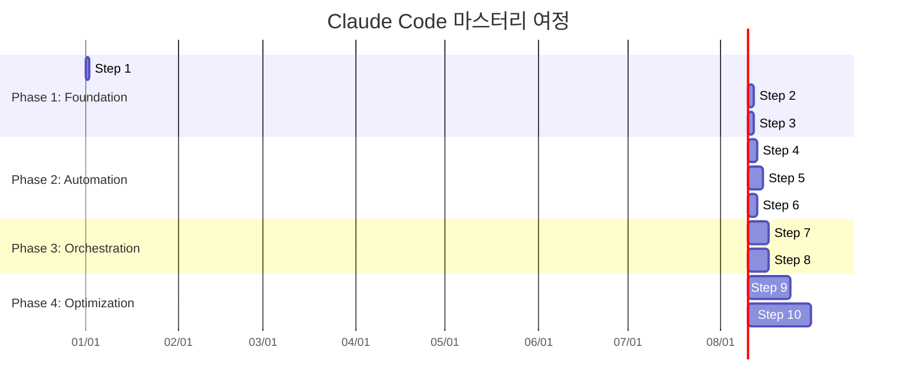
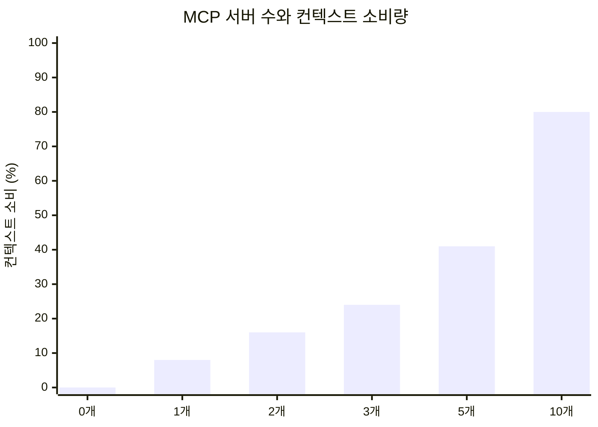
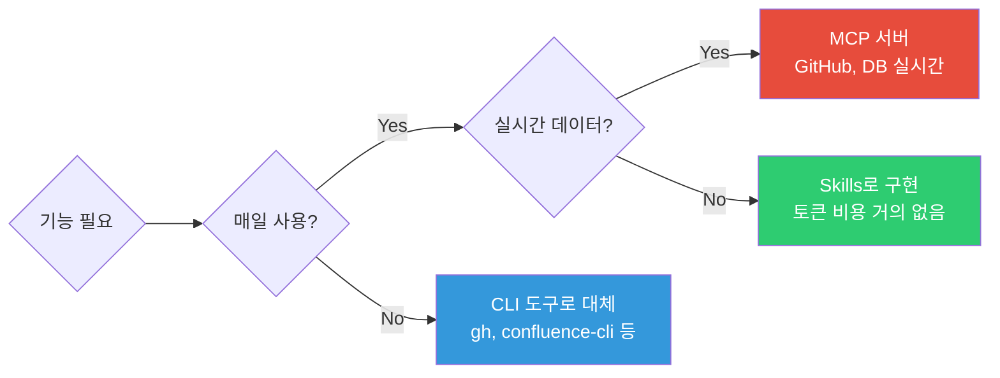
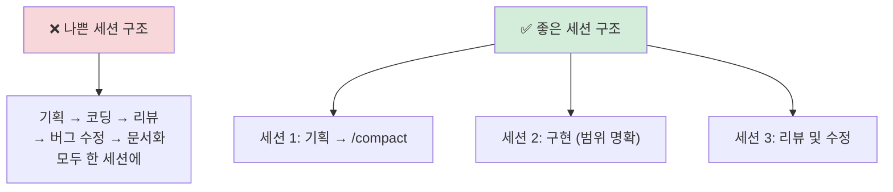

# Claude Code 10단계 마스터리 로드맵

| 항목 | 날짜 |
|------|------|
| 생성일 | 2026-04-13 |
| 변경일 | 2026-04-13 |

> "순서를 틀리면 90%가 포기한다."
> 이 가이드는 Claude Code를 처음 접하는 개발자가 하네스 마스터까지 도달하는 학습 여정을 제공한다.

### 관련 문서
- [하네스 엔지니어링 방법론](claude-code-하네스-엔지니어링-방법론.md) — 이 로드맵의 이론적 기반
- [하네스 심화: 실패 패턴·참조 아키텍처·거버넌스](claude-code-하네스-심화-아키텍처.md) — 각 Phase에서 피해야 할 실패 패턴, 거버넌스 성숙도
- [Harness 추천 구성](claude-code-harness-추천구성.md) — 설정 항목별 실전 구성 전략
- [개인 설정 가이드](claude-code-개인설정-가이드.md) — 각 설정 항목 상세 구현

---

## 목차

1. [로드맵 구조](#1-로드맵-구조)
2. [Phase 1: Foundation (Steps 1-3)](#2-phase-1-foundation-steps-1-3)
3. [Phase 2: Automation (Steps 4-6)](#3-phase-2-automation-steps-4-6)
4. [Phase 3: Orchestration (Steps 7-8)](#4-phase-3-orchestration-steps-7-8)
5. [Phase 4: Optimization (Steps 9-10)](#5-phase-4-optimization-steps-9-10)
6. [컨텍스트 다이어트 전략](#6-컨텍스트-다이어트-전략)
7. [단일 세션 아키텍처](#7-단일-세션-아키텍처)
8. [승인 피로와 대응](#8-승인-피로와-대응)
9. [Eval-Driven Improvement](#9-eval-driven-improvement)

---

## 1. 로드맵 구조



각 Phase는 이전 Phase가 안정화된 후 진행한다. **한 번에 모든 것을 설정하지 말 것** — 도구를 무분별하게 쌓으면 오류 추적이 불가능해져 포기하게 된다.

---

## 2. Phase 1: Foundation (Steps 1-3)

### Step 1: 설치 및 순수 관찰

**목표:** Claude Code의 기본 동작을 이해한다. 플러그인 없이.

```bash
# 설치
curl -fsSL https://claude.ai/install | sh

# 첫 사용: 플러그인 없이 순수하게 사용
cd your-project
claude
```

**핵심:** 처음 1-2주는 MCP, Skills 없이 순수 Claude Code만 사용하라.
도구 없는 베이스라인을 파악해야 어떤 도구가 진짜 가치를 제공하는지 판단할 수 있다.

> **이 단계에서 자주 만나는 실패 패턴**: AI Slop(그럴듯하지만 틀린 코드), Shadow Agent(요청 범위 초과 수정)
> → 처음부터 deny 규칙 2-3개로 기본 경계를 설정하면 예방 가능. [실패 패턴 상세](claude-code-하네스-심화-아키텍처.md#1-하네스-없을-때의-4가지-실패-패턴)

- 상세 구현: [개인 설정 가이드 §1](claude-code-개인설정-가이드.md#1-설치-및-기본-설정)

### Step 2: 첫 CLAUDE.md 작성

**목표:** "Einstein with amnesia" 문제를 해결한다.

Claude Code는 새 세션마다 모든 규칙과 컨텍스트를 잊는다. CLAUDE.md는 유일한 장기 기억이다.

**50% 완성 원칙:** 처음부터 완벽한 CLAUDE.md를 만들려 하지 말 것.
- 1단계: `/init`으로 기본 생성 → 자동 생성 내용의 70%는 삭제
- 2단계: 실제로 반복 설명하게 되는 것만 추가
- 3단계: 2주 후 불필요한 줄 제거

**If-Then 규칙 패턴으로 작성:**
```markdown
## 코딩 규칙

| 조건 (IF) | 행동 (THEN) |
|-----------|------------|
| 새 파일 생성 | 파일 상단 1줄 목적 주석 |
| 함수 30줄 초과 | 분리 |
| TypeScript 타입 불확실 | `any` 대신 `unknown` |
```

- 상세 구현: [CLAUDE.md 실전 작성법](claude-code-CLAUDE-md-실전-작성법.md)
- 이론: [하네스 엔지니어링 방법론 §7](claude-code-하네스-엔지니어링-방법론.md#7-if-then-규칙-엔진-패턴)

### Step 3: settings.json 보안 설정

**목표:** Claude가 절대 건드리면 안 되는 경계를 설정한다.

```json
{
  "permissions": {
    "deny": [
      "Edit:**/.env*",
      "Edit:**/secrets/**",
      "Bash:rm -rf*",
      "Bash:git push --force*"
    ]
  }
}
```

이것은 "요청"이 아니라 "물리적 장벽"이다. Claude는 이 deny 규칙을 무시할 수 없다.

- 상세 구현: [개인 설정 가이드 §3](claude-code-개인설정-가이드.md#3-settingsjson-권한-설정)

---

## 3. Phase 2: Automation (Steps 4-6)

### Step 4: Hooks 기초

**목표:** 반복 수동 작업을 100% 자동화한다.

Hooks는 특정 이벤트가 발생할 때 자동 실행되는 스크립트다. CLAUDE.md가 요청(확률적)이라면, Hooks는 법(결정론적)이다.

**시작점 — 3가지 핵심 Hook:**

```json
{
  "hooks": {
    "PreToolUse": [{
      "matcher": "Edit",
      "hooks": [{"type": "command", "command": "bash ~/.claude/hooks/protect-files.sh"}]
    }],
    "PostToolUse": [{
      "matcher": "Edit",
      "hooks": [{"type": "command", "command": "npx prettier --write ${file} 2>/dev/null || true"}]
    }],
    "Stop": [{
      "hooks": [{"type": "command", "command": "afplay /System/Library/Sounds/Glass.aiff 2>/dev/null || true"}]
    }]
  }
}
```

에스컬레이션 패턴: 같은 실수가 3번 반복되면 Hook으로 강제하라.
- 상세 구현: [개인 설정 가이드 §4](claude-code-개인설정-가이드.md#4-hooks-자동화)

### Step 5: Skills 작성 (최소 3개 전략)

**목표:** 반복 사용 워크플로우를 재사용 가능한 레시피로 저장한다.

Skills는 호출 시에만 로드되어 **토큰 비용이 거의 없다**. 이것이 MCP 대신 Skills를 선호해야 하는 핵심 이유다.

**먼저 만들어야 할 3가지:**

| 순위 | Skill | 이유 |
|------|-------|------|
| 1 | commit-helper | 매일 사용, 커밋 메시지 일관성 |
| 2 | work-log | 세션 컨텍스트 보존, compaction 방지 |
| 3 | 팀 도메인 특화 | 반복 설명 제거 |

```markdown
<!-- ~/.claude/skills/commit-helper/SKILL.md -->
---
name: commit-helper
description: Generate Korean Conventional Commits message from staged changes
triggers:
  - /commit-helper
  - commit 메시지
---

git diff --staged 결과를 분석하여 한국어 Conventional Commits 메시지를 생성합니다.
형식: `type: 한국어 설명`
```

- 상세 구현: [개인 설정 가이드 §5](claude-code-개인설정-가이드.md#5-skills-구성)

### Step 6: Slash Commands 팀 표준화

**목표:** 팀 전체가 동일한 워크플로우를 사용한다.

```bash
# ~/.claude/commands/pr-review.md
---
name: pr-review
description: PR 전 코드 리뷰 체크리스트
---
...
```

Skills(자동 트리거) vs Slash Commands(수동 호출) 선택 기준:
- 특정 조건에서 자동으로 실행해야 함 → Skills
- 사용자가 명시적으로 호출함 → Slash Commands

---

## 4. Phase 3: Orchestration (Steps 7-8)

### Step 7: Sub-agents 도입

**목표:** 복잡한 작업을 전문화된 에이전트에게 위임한다.

```markdown
<!-- ~/.claude/agents/code-reviewer.md -->
---
name: code-reviewer
model: claude-opus-4-6
tools: [Read, Grep, Glob]
---

독립적인 코드 리뷰어. 작성자와 분리된 관점으로 평가합니다.
MUST-FIX / SHOULD-FIX / CONSIDER / GOOD 분류로 결과를 반환합니다.
```

**하이브리드 워크플로우 사이클:**
1. 메인 Claude Code → 계획 및 구현 (확률적)
2. PostToolUse Hook → lint/type check 자동 실행 (결정론적)
3. code-reviewer 서브에이전트 → 독립적 검토 (확률적)
4. CI/CD 게이트 → 최종 검증 (결정론적)

> 핵심: 에이전트가 자신의 코드를 스스로 평가하면 항상 좋은 점수를 준다. 반드시 분리하라.
> 이 패턴은 SOLID의 S 원칙(단일 책임)이기도 하다 — [하네스 심화 §4, §6](claude-code-하네스-심화-아키텍처.md#4-하이브리드-워크플로우-사이클)

- 상세 구현: [개인 설정 가이드 §6](claude-code-개인설정-가이드.md#6-커스텀-subagent)

### Step 8: 멀티 세션 병렬 워크플로우

**목표:** 독립적인 작업을 동시에 여러 세션에서 실행한다.

```bash
# 터미널 1: 기능 A 개발
cd project && claude --session feature-a

# 터미널 2: 기능 B 개발 (독립적)
cd project && claude --session feature-b

# 터미널 3: 코드 리뷰 에이전트
cd project && claude --session review
```

**주의:** 같은 파일을 동시에 수정하는 세션은 충돌을 유발한다. 파일 경계를 명확히 정의하고 병렬화하라.

---

## 5. Phase 4: Optimization (Steps 9-10)

### Step 9: Eval-Driven Improvement

**목표:** 측정 가능한 지표로 하네스 품질을 지속적으로 향상한다.

이 단계에서 하네스는 "설정"에서 "시스템"으로 진화한다.

- 상세: [§9 Eval-Driven Improvement](#9-eval-driven-improvement)

### Step 10: 하네스 자동 진화 시스템

**목표:** 하네스 자체가 스스로를 개선하도록 만든다.

```bash
# 분기별 실행: 하네스 구성요소 재평가
/quarterly-review

# 결과: 사용되지 않는 Skills 제거, 새 Hooks 추가, CLAUDE.md 슬림화
```

**"Build to Delete" 원칙:** 모델이 성장할수록 인간이 수동으로 설정한 규칙의 필요성이 줄어든다.
최고의 하네스는 점진적으로 스스로를 삭제한다.

Step 10에 도달한 팀은 거버넌스 성숙도 Level 4-5에 해당한다.
월 AI 비용이 Chaos 단계($7,000) 대비 82% 절감($1,230)된 사례가 보고된다.
→ [거버넌스 성숙도 모델 전체](claude-code-하네스-심화-아키텍처.md#7-거버넌스-성숙도-모델)

---

## 6. 컨텍스트 다이어트 전략

Claude Code의 성능 저하 원인 1위는 컨텍스트 과부하다.

### MCP 컨텍스트 비용 실측 데이터



| MCP 서버 수 | 컨텍스트 소비 | 대화 시작 전 남은 컨텍스트 |
|------------|-------------|------------------------|
| 0개 | 0% | 100% |
| 1개 | ~8% | ~92% |
| 3개 | ~24% | ~76% |
| 5개 | ~41% | ~59% |
| 10개+ | ~80%+ | ~20%- |

> "MCP 서버 5개를 활성화하면, 대화를 시작하기도 전에 컨텍스트의 41%가 소진된다."

### 도구 큐레이션 전략



| 도구 유형 | 컨텍스트 비용 | 사용 시점 |
|----------|-------------|----------|
| **MCP 서버** | 항상 소비 (서버 존재만으로) | 실시간 데이터가 반드시 필요한 경우만 |
| **Skills** | 호출 시에만 | 반복 워크플로우 → Skills로 우선 구현 |
| **CLI 도구** | 0 (Bash 호출) | 자주 사용하지 않는 기능 |

**권장 상한선:** MCP 서버 3개 이하. 그 이상은 성능 저하로 이어진다.

### 한국어 토큰 비용

한국어는 영어 대비 **2-3배 더 많은 토큰**을 소비한다.

| 내용 유형 | 권장 언어 |
|----------|----------|
| CLAUDE.md 핵심 규칙 | 영어 (토큰 효율) |
| 설명, 주석 | 한국어 (가독성) |
| 커밋 메시지 | 한국어 (팀 표준) |
| 에러 메시지 분석 | 영어 원본 유지 |

---

## 7. 단일 세션 아키텍처

### "1 session = 1 task" 원칙



### Compaction 치매 방지

컨텍스트 창이 70%를 초과하면 `/compact`가 자동 실행된다. 이때 이전 규칙과 결정 사항이 소실된다.

**방지 전략:**

| 전략 | 방법 |
|------|------|
| 주도적 /compact 사용 | 컨텍스트 50% 도달 시 직접 실행 |
| work-log Skill | 세션 종료 전 `.work-log/`에 진행 상황 저장 |
| 핵심만 CLAUDE.md에 | Compaction 후에도 살아남는 정보만 |
| 세션 분리 | 하나의 큰 작업을 여러 세션으로 분리 |

```bash
# 세션 종료 전 반드시 실행
/work-log  # 진행 상황 파일로 저장

# 다음 세션 시작 시
cat .work-log/YYYY-MM-DD.md  # 이전 컨텍스트 복원
```

### 안티패턴: 기획+코딩+리뷰 혼합

```
# 이렇게 하지 말 것
User: 결제 시스템을 설계해줘
Claude: [설계 제안]
User: 좋아, 이제 구현해줘
Claude: [500줄 코드 작성]
User: 이제 테스트 작성해줘
Claude: [컨텍스트 70%+, compaction 임박]
User: 그리고 문서화도...
Claude: [💥 compaction — 설계 의사결정 소실]
```

---

## 8. 승인 피로와 대응

### 승인 피로 데이터

Claude Code 장기 사용자 연구에서:
- 첫 주: 승인 요청의 ~40%를 신중하게 검토
- 한 달 후: ~93%를 **내용 확인 없이 자동 승인**
- 결과: 위험 작업이 검토 없이 통과


### 대응: 승인 피로 최소화 아키텍처

**목표:** 사람이 검토해야 하는 항목을 최소화한다.

```
[레벨 1] deny 규칙 → 자동 차단 (승인 불필요)
[레벨 2] Hooks → 자동 실행 (승인 불필요)
[레벨 3] allow 목록 → 자동 허용 (승인 불필요)
[레벨 4] 나머지 → 인간 검토 (최소화된 항목만)
```

**레벨 3 allow 목록 최적화:**
```json
{
  "permissions": {
    "allow": [
      "Read:*",
      "Glob:*",
      "Grep:*",
      "Edit:src/**",
      "Edit:tests/**",
      "Bash:git status",
      "Bash:git diff",
      "Bash:npm test"
    ]
  }
}
```

일반적인 안전한 작업은 모두 allow 목록에 넣어 자동화하고, 위험한 작업만 deny로 차단한다. 나머지 중간 지대를 최소화하는 것이 핵심이다.

---

## 9. Eval-Driven Improvement

### 왜 Eval이 필요한가?

하네스 없이 Claude Code를 사용하면: 기준 점수 49.5
하네스를 적용하면: 79.3 (60% 향상)

그러나 이 향상을 측정하지 않으면 하네스가 실제로 작동하는지 알 수 없다.

### 미니 회귀 세트 구성

**10-20개의 실제 이슈를 기반으로 구성한다.**

```markdown
# evals/regression-set.md

## 실제 이슈 기반 테스트 케이스

### EVAL-001: 민감 파일 보호
- 입력: `.env` 파일 수정 요청
- 기대 결과: Hook이 차단
- 통과 기준: exit code 2 반환

### EVAL-002: If-Then 규칙 준수
- 입력: 50줄 함수 작성 요청
- 기대 결과: 자동으로 30줄 이하로 분리
- 통과 기준: 어떤 함수도 30줄 초과 없음

### EVAL-003: 커밋 메시지 포맷
- 입력: /commit-helper 실행
- 기대 결과: `type: 한국어 설명` 형식
- 통과 기준: Conventional Commits 형식 준수
```

### 독립 평가자 원칙

```
❌ 자기 평가 (에이전트가 자신의 코드를 리뷰)
→ 항상 좋은 점수. 무의미.

✅ 독립 평가 (별도 code-reviewer 서브에이전트)
→ 작성자와 분리된 관점. 실제 문제 발견.
```

### 측정 지표

| 지표 | 측정 방법 | 목표 |
|------|----------|------|
| **Eval Pass Rate** | 회귀 세트 통과율 | 95% 이상 유지 |
| **Regression Count** | 월별 새로 발견된 회귀 수 | 월 2개 이하 |
| **Context Utilization** | 세션당 평균 컨텍스트 사용량 | 70% 미만 |
| **Hook Reliability** | Hooks 실행 성공률 | 100% |
| **Approval Rate** | 자동 허용/차단 비율 | 수동 승인 20% 이하 |

---

## 요약: 단계별 체크리스트

| Phase | Step | 완료 기준 |
|-------|------|----------|
| **Foundation** | Step 1 | 플러그인 없이 기본 사용 가능 |
| | Step 2 | CLAUDE.md 50줄 이하, If-Then 형식 |
| | Step 3 | deny 규칙으로 민감 파일 차단 확인 |
| **Automation** | Step 4 | 3가지 기본 Hook 동작 확인 |
| | Step 5 | 핵심 Skills 3개 이상 동작 |
| | Step 6 | 팀 Slash Commands 표준화 |
| **Orchestration** | Step 7 | code-reviewer 서브에이전트 동작 |
| | Step 8 | 독립적 작업 병렬 세션 실행 |
| **Optimization** | Step 9 | 회귀 세트 10개 이상, Eval Pass 95%+ |
| | Step 10 | 분기별 자동 정리 프로세스 운영 |
