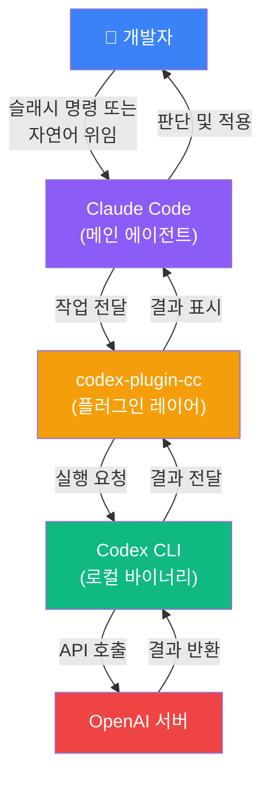
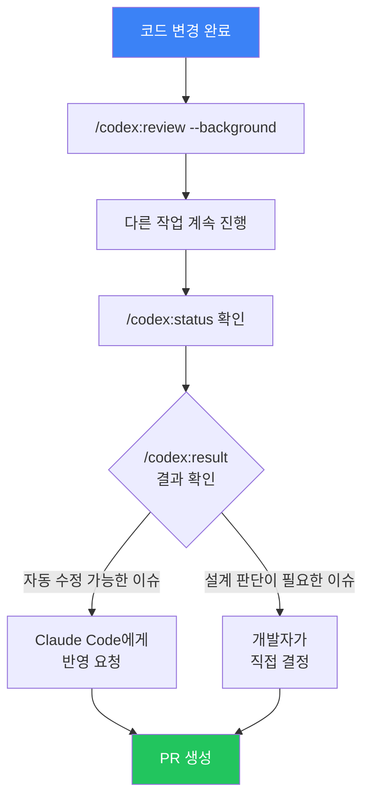
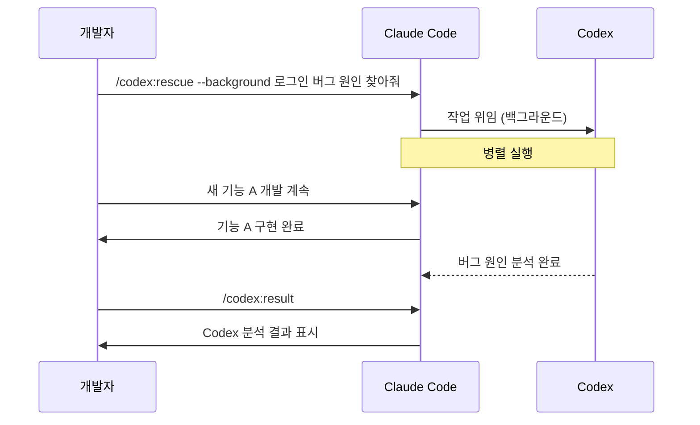

# Claude Code × OpenAI Codex 공식 플러그인 완전 가이드 (codex-plugin-cc)

| 항목 | 내용 |
|------|------|
| 생성일 | 2026-04-08 |
| 변경일 | 2026-04-08 |
| 목적 | codex-plugin-cc 공식 플러그인 설치부터 실전 워크플로우까지 초보자 완전 가이드 |
| 참조 | [GitHub: openai/codex-plugin-cc](https://github.com/openai/codex-plugin-cc) · Apache 2.0 · v1.0.2 |

> OpenAI가 2026/03/30에 공개한 공식 Claude Code 플러그인.
> Claude Code 세션 안에서 슬래시 명령 한 번으로 Codex 코드 리뷰와 작업 위임이 가능합니다.

### 관련 문서
- [초보자 튜토리얼](claude-code-초보자-튜토리얼.md) — Skills, Hooks, 하네스 기초
- [팀 IDE 통합 가이드](claude-code-팀-IDE-통합-가이드.md) — 플러그인 생태계, CI/CD
- [크로스 에이전트 워크플로우 (수동 CLI)](../drafts/claude-code-cross-agent-워크플로우.md) — 셸 파이프, MCP 브릿지 심화

---

## 목차

1. [이 가이드의 범위](#1-이-가이드의-범위)
2. [사전 준비](#2-사전-준비)
3. [5분 퀵스타트](#3-5분-퀵스타트)
4. [아키텍처 이해](#4-아키텍처-이해)
5. [슬래시 명령어 완전 정리](#5-슬래시-명령어-완전-정리)
6. [실전 워크플로우 1 — Pre-PR 코드 리뷰](#6-실전-워크플로우-1--pre-pr-코드-리뷰)
7. [실전 워크플로우 2 — 적대적 보안 리뷰](#7-실전-워크플로우-2--적대적-보안-리뷰)
8. [실전 워크플로우 3 — 작업 위임 (rescue)](#8-실전-워크플로우-3--작업-위임-rescue)
9. [고급 패턴 — Validation Prompt & Review Gate](#9-고급-패턴--validation-prompt--review-gate)
10. [단계별 도입 전략](#10-단계별-도입-전략)
11. [비용 및 제한 사항](#11-비용-및-제한-사항)
12. [트러블슈팅 & FAQ](#12-트러블슈팅--faq)
13. [수동 CLI 연계와의 비교](#13-수동-cli-연계와의-비교)

---

## 1. 이 가이드의 범위

### 공식 플러그인이란?

`codex-plugin-cc`는 OpenAI가 직접 만들어 배포한 Claude Code 전용 플러그인입니다. Claude Code 세션을 벗어나지 않고 Codex를 **리뷰어** 또는 **보조 에이전트**로 호출할 수 있게 해줍니다.

**이 문서가 다루는 것**: 공식 플러그인의 설치, 명령어, 실전 워크플로우
**이 문서가 다루지 않는 것**: 셸 파이프 오케스트레이션, 루프 스크립트, MCP 브릿지 → [크로스 에이전트 워크플로우](../drafts/claude-code-cross-agent-워크플로우.md) 참조

### 접근 방식 비교

| 접근 방식 | 문서 | 특징 | 추천 대상 |
|-----------|------|------|-----------|
| **공식 플러그인** (이 문서) | 이 가이드 | 슬래시 명령, 자동 통합, 4줄 설치 | **대부분의 개발자** |
| 수동 셸 파이프 | [크로스 에이전트 워크플로우](../drafts/claude-code-cross-agent-워크플로우.md) | 커스터마이징 높음, 스크립트 작성 필요 | 파워 유저 |
| MCP 브릿지 | [크로스 에이전트 워크플로우](../drafts/claude-code-cross-agent-워크플로우.md) | 팀 자동화, 서버 관리 필요 | 팀 인프라 담당자 |

---

## 2. 사전 준비

### 필수 요건 체크리스트

시작 전에 아래 항목을 모두 확인하세요.

| 항목 | 확인 명령어 | 최소 버전 |
|------|-----------|-----------|
| Node.js | `node -v` | **18.18 이상** |
| Claude Code | `claude --version` | 최신 버전 권장 |
| Codex CLI | `codex --version` | 최신 버전 |
| OpenAI 인증 | `codex whoami` | — |

### Codex CLI 설치 (미설치 시)

```bash
# npm으로 전역 설치
npm install -g @openai/codex

# 설치 확인
codex --version
```

### OpenAI 인증 설정

Codex를 사용하려면 OpenAI 인증이 필요합니다. 두 가지 방식 중 하나를 선택하세요.

| 인증 방식 | 방법 | 장점 | 단점 |
|-----------|------|------|------|
| **ChatGPT 구독** | `codex login` | 무료 플랜도 사용 가능, 간편 | 개인 계정 연동 |
| **OpenAI API 키** | 환경 변수 설정 | 팀/조직 거버넌스 용이 | 별도 과금 발생 |

**ChatGPT 계정으로 로그인:**
```bash
codex login
# 브라우저가 열리며 OpenAI 계정 로그인 진행
```

**API 키 방식:**
```bash
# ~/.zshrc 또는 ~/.bashrc에 추가
export OPENAI_API_KEY="sk-..."

# 적용
source ~/.zshrc
```

> **팁**: 개인 개발자는 ChatGPT Free 플랜으로 시작하는 것이 가장 간편합니다. 팀 도입 시 API 키 방식을 권장합니다.

---

## 3. 5분 퀵스타트

### 설치 4단계

Claude Code 세션 안에서 아래 명령어를 순서대로 실행합니다.

```
# Step 1: OpenAI 마켓플레이스 등록
/plugin marketplace add openai/codex-plugin-cc

# Step 2: 플러그인 설치
/plugin install codex@openai-codex

# Step 3: 플러그인 리로드 (재시작 없이 적용)
/reload-plugins

# Step 4: 초기 설정 및 연결 확인
/codex:setup
```


### `/codex:setup` 실행 결과 예시

```
✅ Codex CLI found: /usr/local/bin/codex (v2.1.3)
✅ Authentication: Logged in as user@example.com
✅ Model: gpt-5.4-mini
✅ Plugin ready. Try /codex:review to get started.
```

> Codex CLI가 설치되지 않은 경우 `/codex:setup`이 자동으로 설치를 제안합니다.

### 첫 번째 리뷰 해보기

설치 후 바로 리뷰를 실행해 보세요.

```bash
# 먼저 변경사항이 있는지 확인
git diff --stat

# Claude Code 세션에서 실행
/codex:review
```

완료 후 `/codex:status`를 입력하면 실행 상태를 확인할 수 있습니다.

---

## 4. 아키텍처 이해

### 전체 흐름



### 각 레이어 역할

| 레이어 | 역할 | 위치 |
|--------|------|------|
| **Claude Code** | 메인 에이전트, 사용자 인터페이스 | 로컬 |
| **codex-plugin-cc** | 명령어 번역, 결과 통합 | 로컬 (플러그인) |
| **Codex CLI** | 실제 코드 분석/실행 엔진 | 로컬 바이너리 |
| **OpenAI 서버** | Codex 모델 추론 | 클라우드 |

### 자연어 위임

슬래시 명령 외에도 자연어로 Codex에 작업을 위임할 수 있습니다.

```
사용자: "Codex에게 이 함수의 메모리 누수 가능성을 찾아달라고 해"
→ Claude Code가 자동으로 /codex:rescue를 통해 위임
```

### 중요한 특징

- **로컬 실행**: Codex CLI는 로컬에 설치된 바이너리를 사용하므로, 기존 `~/.codex/config.toml` 설정이 그대로 적용됩니다.
- **독립적 인증**: Claude Code와 Codex는 각각 별도의 인증이 필요합니다.
- **공유 컨텍스트**: Claude Code 세션 안에서 실행되므로, 파일 시스템과 프로젝트 컨텍스트를 공유합니다.

---

## 5. 슬래시 명령어 완전 정리

### 명령어 한눈에 보기

| 명령어 | 역할 | 소요 시간 | 사용 시점 |
|--------|------|-----------|-----------|
| `/codex:review` | 현재 변경사항 코드 리뷰 | 1~3분 | PR 생성 전 |
| `/codex:adversarial-review` | 보안/엣지케이스 집중 검증 | 3~10분 | 보안 민감 코드 |
| `/codex:rescue` | 작업 위임 (디버깅, 리팩토링 등) | 5~30분 | 병렬 작업 시 |
| `/codex:status` | 진행 중인 작업 상태 확인 | 즉시 | 작업 대기 중 |
| `/codex:result` | 완료된 작업 결과 조회 | 즉시 | status 완료 표시 후 |
| `/codex:cancel` | 진행 중인 작업 취소 | 즉시 | 잘못된 요청 취소 시 |

---

### `/codex:review` — 표준 코드 리뷰

현재 `git diff`의 변경사항을 Codex가 읽고 코드 품질, 버그 가능성, 개선 제안을 제공합니다.

```bash
# 기본 실행
/codex:review

# 특정 브랜치 대비 리뷰
/codex:review --base main

# 백그라운드로 실행 (대용량 변경 시 권장)
/codex:review --background

# 완료까지 대기
/codex:review --wait
```

**특징**: 읽기 전용 (코드를 변경하지 않음), 방향 지정 불가 (특정 관점 지시 불가)

---

### `/codex:adversarial-review` — 적대적 보안 리뷰

Codex가 "악의적인 비평가" 역할을 수행합니다. 설계 결정, 트레이드오프, 엣지 케이스, 보안 취약점에 집중합니다.

```bash
# 기본 실행
/codex:adversarial-review

# 특정 영역 집중 지시 (자유 텍스트 가능)
/codex:adversarial-review --base main 이 캐시 설계가 동시성 문제를 안전하게 처리하는지 검증해줘

# 인증 로직 집중 검토
/codex:adversarial-review 인증 미들웨어의 토큰 검증 로직에서 취약점을 찾아줘
```

**특징**: 자유 텍스트 방향 지시 가능, 표준 리뷰보다 강도 높은 피드백

---

### `/codex:rescue` — 작업 위임

Codex가 하나의 독립적인 서브 에이전트로서 작업을 수행합니다. Claude Code가 다른 작업을 하는 동안 병렬로 실행됩니다.

```bash
# 기본 위임
/codex:rescue 플래키 로그인 테스트의 원인을 찾아줘

# 백그라운드 실행
/codex:rescue --background user_service.py의 메모리 사용을 최적화해줘

# 모델 선택 (비용 절약)
/codex:rescue --model gpt-5.4-mini 불필요한 console.log를 제거해줘

# 저렴한 빠른 모델
/codex:rescue --model spark 주석 스타일을 프로젝트 표준에 맞게 정리해줘

# 특정 세션 재개
/codex:rescue --resume <session-id>
```

**rescue에 적합한 작업:**
- 버그 원인 조사 (구현은 Claude Code가)
- 테스트 코드 보완
- 코드 정리 및 리팩토링 탐색
- 문서 초안 생성

---

### `/codex:status` — 진행 상태 확인

```bash
# 전체 작업 목록
/codex:status

# 특정 작업 조회
/codex:status <task-id>
```

출력 예시:
```
TASK ID     STATUS      STARTED     COMMAND
abc123      running     2분 전      /codex:review --background
def456      completed   15분 전     /codex:rescue 버그 조사
```

---

### `/codex:result` — 완료 결과 조회

```bash
# 최근 완료 작업 결과
/codex:result

# 특정 작업 결과
/codex:result <task-id>
```

---

### `/codex:cancel` — 작업 취소

```bash
# 실행 중인 작업 취소
/codex:cancel <task-id>
```

---

## 6. 실전 워크플로우 1 — Pre-PR 코드 리뷰

### 흐름 개요



### 단계별 실행

**1단계: 리뷰 시작 (백그라운드 권장)**

```bash
# 변경사항 확인
git diff --stat

# 백그라운드로 리뷰 시작
/codex:review --background
```

출력:
```
✅ Codex review started in background (task: abc123)
Use /codex:status to check progress, /codex:result to see findings.
```

**2단계: 진행 확인**

```bash
/codex:status
```

**3단계: 결과 확인 및 반영**

```bash
/codex:result
```

출력 예시:
```
📋 Code Review Results

[P1] Silent failure on missing config
  File: src/config/loader.ts:42
  Issue: If project config is missing, function returns undefined silently
  Suggestion: Add explicit error handling or validation

[P2] Concurrent request state collision
  File: src/api/client.ts:87
  Issue: Multiple concurrent requests may overwrite shared state
  Suggestion: Consider request queue or mutex pattern
```

**4단계: Validation Prompt로 반영**

모든 리뷰 코멘트를 맹목적으로 반영하지 마세요. Claude Code에 이렇게 요청하세요:

```
Codex 리뷰 결과를 분석해서, 실제로 수정이 필요한 항목과 설계 판단이 필요한 항목을 분류해줘.
수정이 확실한 것만 먼저 처리하고, 판단이 필요한 것은 나에게 물어봐.
```

---

### 실제 사례: Nathan Onn의 PinFlow 리뷰

> Nathan Onn은 Chrome 확장 PinFlow의 사이드바 UI를 리디자인하면서 `/codex:review`를 사용했습니다.
>
> Claude Code가 9분 만에 리디자인을 완료한 후, Codex 리뷰에서 4개 이슈가 발견되었습니다:
> - **P1**: 프로젝트 설정 누락 시 silent failure
> - **P2**: 폼 검증을 우회하는 네비게이션 경로
> - **P2**: 비동기 요청 중단 처리 누락
> - **P2**: 동시 요청 상태 충돌
>
> 검증 프롬프트를 통해 자동 수정 가능한 2개는 즉시 반영, 나머지 2개는 설계 결정 후 반영. **전체 소요: 2분 미만**
>
> *"Codex becomes a filter between the review and your code."* — Nathan Onn

---

## 7. 실전 워크플로우 2 — 적대적 보안 리뷰

### `/codex:review` vs `/codex:adversarial-review`

| 항목 | `/codex:review` | `/codex:adversarial-review` |
|------|-----------------|------------------------------|
| 리뷰 관점 | 협력적 — 개선 제안 | 적대적 — 취약점 탐색 |
| 방향 지시 | 불가 | **자유 텍스트 가능** |
| 소요 시간 | 짧음 (1~3분) | 김 (3~10분) |
| 적합 대상 | 일반 코드 변경 | 보안/동시성/캐시/API 코드 |
| 피드백 강도 | 건설적 | **도전적, 비판적** |

### 언제 사용해야 하나?

다음 코드를 변경할 때 `adversarial-review`를 사용하세요:
- 인증/인가 로직
- 캐시 설계
- 동시성/비동기 처리
- 외부 API 연동
- 파일 업로드/다운로드
- SQL 쿼리 또는 ORM 사용

### 실행 예시

```bash
# 기본 — Codex가 취약점을 스스로 결정
/codex:adversarial-review

# 특정 영역 집중 지시
/codex:adversarial-review --base main 이 캐시 무효화 로직이 동시 쓰기 상황을 안전하게 처리하는지 검증해줘

# 보안 코드 집중 검토
/codex:adversarial-review JWT 검증 로직의 우회 가능성을 확인해줘
```

---

### 실제 사례: Reza Rezvani의 캐시 레이스컨디션 발견

> Reza Rezvani는 재시도 및 캐싱 설계를 구현한 후 다음 명령을 실행했습니다:
>
> ```
> /codex:adversarial-review --base main 이 재시도와 캐싱 설계가 부분 실패를 처리하는지 검증해줘
> ```
>
> Codex가 **캐시 무효화 경로의 레이스 컨디션**을 발견했습니다. 동시 쓰기 상황에서 표면화되는 설계 결함으로, "며칠 안에 프로덕션에서 발생했을 버그"였습니다.
>
> *"표준 코드 리뷰가 놓친 아키텍처 이슈를 잡았다."* — Reza Rezvani

---

## 8. 실전 워크플로우 3 — 작업 위임 (rescue)

### rescue의 핵심 개념

`/codex:rescue`는 Codex를 **독립적인 서브 에이전트**로 동작시킵니다. Claude Code가 다른 기능을 개발하는 동안, Codex는 별도로 버그 조사나 리팩토링을 수행합니다.



### 단계별 실행

**1단계: 작업 위임**

```bash
# 명확하고 구체적인 범위로 위임
/codex:rescue --background "tests/auth/login.test.ts의 플래키 테스트 원인을 찾아줘. 코드는 변경하지 말고 원인만 분석해줘"
```

> **범위를 좁게**: "전체 리팩토링" 대신 "이 함수의 반환 타입 불일치 원인 파악"

**2단계: 다른 작업 진행**

rescue가 백그라운드에서 실행되는 동안 Claude Code에서 다른 작업을 계속할 수 있습니다.

**3단계: 상태 확인 및 결과 조회**

```bash
/codex:status

# 완료 후
/codex:result <task-id>
```

### rescue 적합 작업 vs 부적합 작업

| 적합 | 부적합 |
|------|--------|
| 버그 원인 분석 | 전체 기능 구현 |
| 테스트 코드 보완 | 복잡한 비즈니스 로직 |
| 코드 정리/주석 추가 | 아키텍처 변경 |
| 타입 오류 수정 | 데이터베이스 스키마 변경 |
| 문서 초안 생성 | 보안 크리티컬 코드 |

---

## 9. 고급 패턴 — Validation Prompt & Review Gate

### 9.1 Validation Prompt 패턴

AI 리뷰 결과를 그대로 적용하는 것은 위험합니다. **검증 프롬프트 패턴**은 Codex 리뷰 → Claude Code 검증 → 개발자 결정의 3단계 필터를 만듭니다.


**검증 프롬프트 템플릿:**

```
Codex 리뷰 결과를 분석해서:
1. 명확히 수정이 필요한 버그/오류 → 바로 수정
2. 트레이드오프가 있는 제안 → 나에게 선택지 제시
3. 스타일/의견 차이 → 무시

수정 전 확신이 95% 이상인 항목만 처리하고, 나머지는 AskUserQuestion으로 확인해줘.
```

---

### 9.2 Review Gate (Stop Hook)

Review Gate는 Claude Code가 응답을 완료하려 할 때마다 자동으로 Codex 리뷰를 실행하는 **Stop Hook**입니다.

**활성화/비활성화:**

```bash
# Review Gate 활성화
/codex:setup --enable-review-gate

# Review Gate 비활성화
/codex:setup --disable-review-gate
```

**동작 방식**: Claude Code가 응답 완료 시도 → Codex가 해당 응답 리뷰 → 이슈 발견 시 중단 → Claude Code가 이슈 해결 후 재시도

> ⚠️ **주의**: Review Gate는 Claude와 Codex 간 긴 루프를 만들어 **사용량을 빠르게 소모**할 수 있습니다. 활성 모니터링 없이는 사용하지 마세요.

**권장 사용 상황:**
- 보안 크리티컬한 작업 (인증, 결제 로직)
- 짧은 세션, 적은 변경사항
- 사용량 여유가 있을 때

---

### 9.3 병렬 리뷰 루프 (고급)

Hamel Husain의 `claude-review-loop` 플러그인은 `/codex:review`를 확장하여 **최대 4개의 Codex 서브 에이전트를 병렬로 실행**합니다.

| 에이전트 | 역할 |
|----------|------|
| Diff Review | 코드 품질, 테스트, 보안 |
| Holistic Review | 구조, 문서, 아키텍처 |
| Next.js Review | 프레임워크 특화 |
| UX Review | UI, 접근성 |

```bash
# claude-review-loop 별도 설치 필요
/review-loop
```

> ⚠️ **보안 경고**: 기본 설정이 `--dangerously-bypass-approvals-and-sandbox` 플래그를 사용합니다. **외부 격리 환경에서만** 사용하세요. 일반 개발 환경에서는 비권장.

---

## 10. 단계별 도입 전략

처음부터 모든 기능을 사용하려 하지 마세요. 3단계로 점진적으로 도입하세요.

| 단계 | 이름 | 기간 | 활동 | 성공 기준 |
|------|------|------|------|-----------|
| **1단계** | 리뷰 전용 | 1~2주 | PR 전 `/codex:review`만 사용 | 매 PR마다 리뷰 실행이 습관화됨 |
| **2단계** | 백그라운드 실행 | 2~4주 | `--background` 패턴, 병렬 작업 | 리뷰 대기 중에도 작업 흐름 유지 |
| **3단계** | 작업 위임 | 4주+ | `/codex:rescue`로 독립 작업 위임 | rescue 결과를 재작업 없이 활용 |

### 1단계: 리뷰 전용

```bash
# 매 PR 전 실행하는 것만으로 시작
/codex:review --base main
```

**다음 단계로 가는 신호**: 리뷰 결과를 확인하고 반영하는 것이 자연스러워졌을 때

---

### 2단계: 백그라운드 실행 패턴

```bash
# 리뷰 시작 → 다른 작업 → 결과 확인
/codex:review --background
# ... 다른 작업 ...
/codex:status
/codex:result
```

**다음 단계로 가는 신호**: 백그라운드 작업 관리가 자연스럽고 결과 활용이 능숙해졌을 때

---

### 3단계: 작업 위임 파일럿

**중요하지 않은 작업부터 시작**하세요. 비즈니스 로직이나 보안 크리티컬 코드에는 아직 rescue를 사용하지 마세요.

```bash
# 낮은 리스크 작업부터
/codex:rescue --model spark "주석 스타일을 Korean으로 통일해줘"
/codex:rescue "TODO 주석에 해당하는 단위 테스트를 추가해줘"
```

---

## 11. 비용 및 제한 사항

### 이중 인증과 비용

codex-plugin-cc를 사용하면 두 개의 AI 서비스를 동시에 사용합니다.

| 시나리오 | Claude Code 비용 | Codex 추가 비용 | 월 합계 (예상) |
|----------|-----------------|-----------------|---------------|
| Claude Pro + ChatGPT Free | $20/월 | $0 (Free 쿼터 내) | **$20/월** |
| Claude Pro + ChatGPT Plus | $20/월 | $20/월 | **$40/월** |
| Claude API + OpenAI API | 사용량 기반 | 사용량 기반 | 변동 |

> **팁**: 개인 개발자는 ChatGPT Free 플랜으로 시작하세요. Free 플랜도 Codex 플러그인을 사용할 수 있습니다.

### 사용량 관리 주의사항

- **Review Gate 자동 루프**: 빠르게 쿼터를 소모합니다. 짧은 세션에서만 사용하세요.
- **`/codex:rescue` 대형 작업**: 복잡한 작업은 오래 걸리고 많은 토큰을 사용합니다. `--model spark`나 `--model gpt-5.4-mini`로 비용을 줄이세요.
- **두 플랫폼 사용량 분리**: Claude Code와 Codex는 각각 별도 사용량 대시보드에서 확인해야 합니다.

### 기술적 제한

| 제한 | 내용 |
|------|------|
| Codex CLI 필수 | 로컬에 반드시 설치 필요 (클라우드만으로 사용 불가) |
| 오프라인 불가 | OpenAI API 호출 필요 |
| `/codex:ask` 없음 | 자유 질문 명령어 미지원 (현재 v1.0.2 기준) |
| 대용량 리뷰 느림 | 수백 파일 변경 시 백그라운드 모드 필수 |
| Node.js 18.18+ 필수 | 구버전 Node.js 미지원 |

---

## 12. 트러블슈팅 & FAQ

### 자주 발생하는 오류

| 증상 | 원인 | 해결 방법 |
|------|------|-----------|
| `Codex CLI not found` | 미설치 또는 PATH 미등록 | `npm install -g @openai/codex` 후 터미널 재시작 |
| `Authentication failed` | API 키 미설정 또는 만료 | `codex login` 재실행 또는 `OPENAI_API_KEY` 확인 |
| `/codex:status`가 계속 `running` | 대용량 코드베이스 처리 중 | 기다리거나 `/codex:cancel` 후 범위 축소 |
| 리뷰 결과가 비어있음 | 변경사항 없음 | `git diff` 로 변경사항 확인 |
| `Sandbox error` | Codex CLI 샌드박스 설정 문제 | `codex --version` 확인 및 CLI 업데이트 |
| 플러그인 명령이 안 보임 | 리로드 누락 | `/reload-plugins` 재실행 |

---

### FAQ

**Q: ChatGPT Free 계정으로도 사용 가능한가요?**

네, 가능합니다. Free 플랜도 Codex 사용 쿼터가 포함되어 있습니다. 단, 쿼터 한도가 낮으므로 무거운 작업은 제한될 수 있습니다.

---

**Q: 오프라인에서 사용할 수 있나요?**

아니요. Codex 실행은 OpenAI API를 통해 클라우드에서 처리됩니다. 인터넷 연결이 필요합니다.

---

**Q: 코드가 OpenAI 서버로 전송되나요?**

네, Codex 리뷰나 rescue 실행 시 해당 코드 컨텍스트가 OpenAI API로 전송됩니다. 민감한 코드(API 키, 개인정보 처리 로직)를 리뷰할 때는 OpenAI 데이터 정책을 확인하세요.

> 기업 환경에서는 `openai_base_url`을 `~/.codex/config.toml`에 설정하여 자체 OpenAI 엔드포인트나 Azure OpenAI를 사용할 수 있습니다.

---

**Q: 기존 Claude Code 플러그인과 충돌하나요?**

일반적으로 충돌하지 않습니다. 단, Review Gate (Stop Hook)를 활성화하면 다른 Stop Hook과 충돌할 가능성이 있습니다. 하나씩 활성화하며 테스트하세요.

---

**Q: Node.js 버전이 18 미만이면 어떻게 하나요?**

`nvm`(Node Version Manager)을 사용하여 Node.js 버전을 업그레이드하는 것을 권장합니다.

```bash
# nvm 설치 후
nvm install 20
nvm use 20
node -v  # v20.x.x 확인
```

---

## 13. 수동 CLI 연계와의 비교

공식 플러그인 외에도 Codex CLI를 수동으로 연계하는 방법이 있습니다. 각 접근 방식을 이해하고 상황에 맞게 선택하세요.

| 항목 | **공식 플러그인** | 셸 파이프 | Claude Code Skill | MCP 브릿지 |
|------|-----------------|-----------|------------------|-----------|
| 설치 난이도 | **낮음** (4 명령) | 중간 (스크립트 작성) | 중간 (SKILL.md) | **높음** (서버 구성) |
| 커스터마이징 | 제한적 | 높음 | **높음** | **매우 높음** |
| 컨텍스트 유지 | **자동** | 수동 파일 관리 | 부분 | **자동** |
| 유지보수 | 플러그인 업데이트 | 스크립트 직접 관리 | SKILL.md 관리 | 서버 운영 |
| 팀 공유 | 쉬움 | 보통 | 쉬움 | 어려움 |
| 적합 대상 | **대부분의 개발자** | 파워 유저 | 팀 내 표준화 | 인프라 팀 |

**선택 가이드:**

- **처음 시작한다면** → 공식 플러그인
- **리뷰 루프를 세밀하게 제어하고 싶다면** → 셸 파이프 또는 Skill
- **팀 전체에 자동화된 파이프라인으로 배포하려면** → MCP 브릿지

수동 CLI 연계의 상세 패턴은 **[크로스 에이전트 워크플로우](../drafts/claude-code-cross-agent-워크플로우.md)** 를 참조하세요.

---

## 참고 자료

- [GitHub: openai/codex-plugin-cc](https://github.com/openai/codex-plugin-cc) — 공식 소스코드 및 README
- [Nathan Onn — Code Reviews Without Blind Spots](https://www.nathanonn.com/codex-plugin-claude-code-review/) — Validation Prompt 패턴 및 PinFlow 사례
- [Reza Rezvani — 3 Codex Workflows](https://alirezarezvani.medium.com/the-new-openais-codex-plugin-for-claude-code-a0affde25ca5) — 적대적 리뷰, 위임 디버깅 사례
- [SmartScope — What codex-plugin-cc Means](https://smartscope.blog/en/blog/codex-plugin-cc-openai-claude-code-2026/) — 시장 분석 및 비용 구조
- [TILNOTE — Claude Code Codex 플러그인 활용법](https://tilnote.io/en/pages/69cb42b3380f446d3fa9ce51) — 한국어 실전 가이드
- [hamelsmu/claude-review-loop](https://github.com/hamelsmu/claude-review-loop) — 병렬 리뷰 루프 플러그인
- [크로스 에이전트 워크플로우 (수동 CLI)](../drafts/claude-code-cross-agent-워크플로우.md) — 셸 파이프, Skill, MCP 브릿지 심화
