# Claude Code 초보자 튜토리얼 — 하네스 구성 완전 가이드

| 항목 | 날짜 |
|------|------|
| 생성일 | 2026-04-03 |
| 변경일 | 2026-04-03 |

> Claude Code를 처음 접하는 개발자를 위한 단계별 튜토리얼.
> 설치부터 팀 공유, CI/CD 자동화, 보안까지 하네스 구성의 전체 흐름을 다룹니다.

### 관련 문서
- [Quick Start (5분 시작)](claude-code-quick-start.md) — 설치 및 첫 실행
- [개인 설정 가이드](claude-code-개인설정-가이드.md) — 설정 항목 상세
- [CLAUDE.md 실전 작성법](claude-code-CLAUDE-md-실전-작성법.md) — 프로젝트별 CLAUDE.md 패턴
- [Harness 추천 구성](claude-code-harness-추천구성.md) — Phase별 구성 로드맵
- [팀 IDE 통합 가이드](claude-code-팀-IDE-통합-가이드.md) — 팀 설정, CI/CD, Agent Teams

---

## 목차

1. [Claude Code란?](#1-claude-code란)
2. [하네스(Harness) 개념 이해](#2-하네스harness-개념-이해)
3. [파일 구조와 설정 계층](#3-파일-구조와-설정-계층)
4. [CLAUDE.md 작성법](#4-claudemd-작성법)
5. [settings.json으로 권한 관리](#5-settingsjson으로-권한-관리)
6. [Hooks — 자동 실행 스크립트](#6-hooks--자동-실행-스크립트)
7. [Skills — 반복 작업 자동화](#7-skills--반복-작업-자동화)
8. [팀 공유 설정](#8-팀-공유-설정)
9. [CI/CD 연동](#9-cicd-연동)
10. [보안 필수 사항](#10-보안-필수-사항)
11. [팀 도입 로드맵](#11-팀-도입-로드맵)

---

## 1. Claude Code란?

터미널(명령줄)에서 AI와 대화하며 코딩하는 도구입니다. VS Code나 JetBrains 같은 IDE에서도 사용할 수 있지만, 기본은 **터미널**입니다.

```bash
# 설치
npm install -g @anthropic-ai/claude-code

# 실행 — 프로젝트 디렉토리에서
cd ~/my-project
claude
```

Claude Code는 코드를 읽고, 편집하고, 터미널 명령을 실행하고, 파일을 검색할 수 있습니다. 이 모든 동작은 사용자의 **허락 하에** 이루어집니다.

> 상세 설치 가이드는 [Quick Start](claude-code-quick-start.md) 참조

---

## 2. 하네스(Harness) 개념 이해

"하네스"란 Claude Code를 **내 상황에 맞게 세팅하는 것**입니다. 마치 말에 안장(harness)을 씌우듯, AI를 내 프로젝트에 맞게 조율합니다.

### 하네스 구성 요소

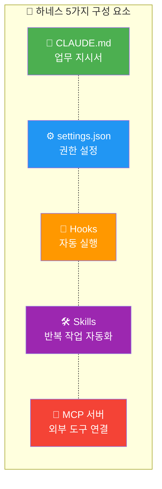

| 요소 | 역할 | 비유 |
|------|------|------|
| **CLAUDE.md** | "이 프로젝트는 이렇게 작업해" 지시서 | 신입에게 주는 업무 매뉴얼 |
| **settings.json** | 허용/금지 권한, 모델 선택 | 사무실 출입카드 권한 |
| **Hooks** | 특정 이벤트 시 자동 실행 | 출퇴근 시 자동으로 불 켜기/끄기 |
| **Skills** | 반복 작업을 `/명령어`로 실행 | 키보드 매크로 |
| **MCP 서버** | Notion, DB 등 외부 도구 연결 | USB 허브에 장치 연결 |

---

## 3. 파일 구조와 설정 계층

### 어떤 파일이 어디에 있나요?

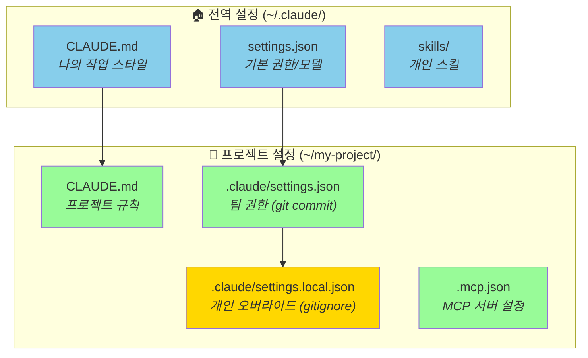

### 설정 우선순위 — 누가 이기나?

여러 곳에 같은 설정이 있으면, 높은 우선순위가 낮은 것을 덮어씁니다.

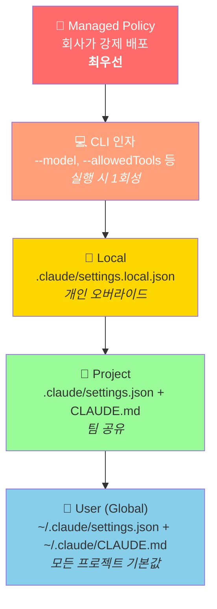

**핵심 규칙**:
- `deny`(금지)는 어디서든 **항상** `allow`(허용)를 이깁니다
- CLAUDE.md는 모든 레벨이 **병합**되어 적용됩니다 (덮어쓰기가 아님)
- settings.json은 높은 우선순위가 **override** 합니다

> 상세 설정 키별 우선순위는 [개인설정 가이드](claude-code-개인설정-가이드.md) 참조

---

## 4. CLAUDE.md 작성법

### 핵심 원칙

> "관광 가이드가 아니라 지뢰밭 경고판" — Addy Osmani

당연한 걸 길게 설명하지 말고, **실수하면 큰일 나는 것**만 적으세요.

### 나쁜 예 vs 좋은 예

```markdown
# ❌ 나쁜 예 — 관광 가이드
우리 프로젝트는 React를 사용합니다.
React는 컴포넌트 기반 UI 라이브러리입니다.
useState, useEffect를 활용하여 상태를 관리합니다.

# ✅ 좋은 예 — 지뢰밭 경고
- legacy-auth 모듈은 절대 삭제하지 마라. 외부 연동 중.
- DB 마이그레이션은 반드시 롤백 스크립트와 함께 작성
- `pnpm generate:types` 실행 후 코딩 시작 (API 타입이 자동 생성됨)
```

### 글로벌 vs 프로젝트 CLAUDE.md

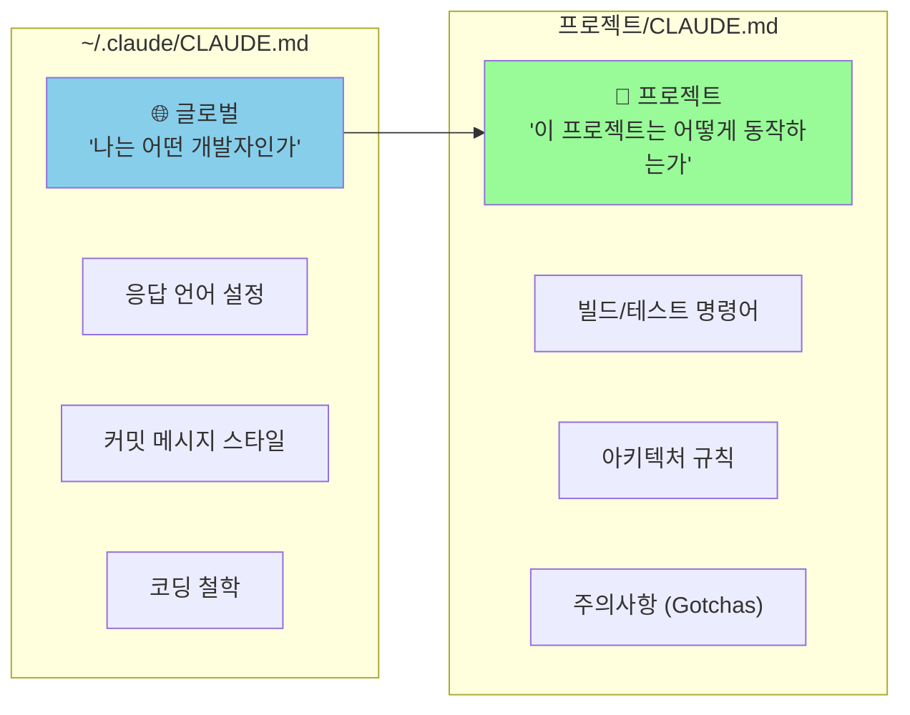

### 실전 예시: Spring Boot 프로젝트

```markdown
# 프로젝트 규칙

## 빌드 & 테스트
- 빌드: `./gradlew build`
- 테스트: `./gradlew test`
- 특정 테스트: `./gradlew test --tests "*.UserServiceTest"`

## 아키텍처
- Controller → Service → Repository (계층 건너뛰기 금지)
- Entity에 @Data 사용 금지 (Dirty Checking 문제)
- QueryDSL 사용 시 Q클래스는 `./gradlew compileQuerydsl` 후 생성

## 주의사항 (Gotchas)
- legacy-auth 모듈: 외부 SSO 연동 중, 수정/삭제 금지
- prod DB 마이그레이션: DBA 승인 후에만 실행
- application-local.yml은 .gitignore에 등록됨 — 직접 생성 필요
```

### 토큰(비용) 관리 팁

한국어는 영어보다 **2~3배 많은 토큰**을 소비합니다.

| 방법 | 설명 |
|------|------|
| 200줄 이하 유지 | 긴 CLAUDE.md는 매 요청마다 토큰을 소비 |
| `@path`로 분리 | `@backend/CLAUDE.md`로 필요한 부분만 import |
| `.claude/rules/` 활용 | 경로별 규칙을 분리하면 해당 파일 작업 시에만 로딩 |

> CLAUDE.md 작성 패턴 상세는 [CLAUDE.md 실전 작성법](claude-code-CLAUDE-md-실전-작성법.md) 참조

---

## 5. settings.json으로 권한 관리

### 기본 구조

```json
{
  "permissions": {
    "allow": [
      "Bash(npm run *)",
      "Bash(npx jest *)"
    ],
    "deny": [
      "Bash(rm -rf *)",
      "Bash(git push --force*)"
    ]
  }
}
```

- `allow`: Claude가 **매번 묻지 않고** 실행 가능
- `deny`: Claude가 **절대 실행 불가** (deny는 항상 allow보다 우선)

### "어디에 설정해야 하나?" 판단 매트릭스

| 설정 내용 | 넣을 곳 | 이유 |
|----------|---------|------|
| 응답 언어·스타일 | Global CLAUDE.md | 모든 프로젝트 공통 |
| 빌드·테스트 명령어 | Project CLAUDE.md | 프로젝트마다 다름 |
| 코드 컨벤션 | Project CLAUDE.md 또는 .claude/rules/ | 팀 공유 필요 |
| 보안 deny 규칙 | settings.json | 100% 강제 |
| 개인 취향 (model, effort) | settings.local.json | 팀 설정과 충돌 방지 |
| 파일 보호·자동 포맷 | Hooks | 이벤트 기반 자동 실행 |
| 경로별 세부 규칙 | .claude/rules/ | 해당 경로 작업 시만 로딩 |

### 프로젝트 vs 개인 설정 분리

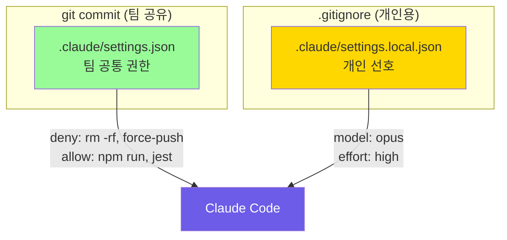

> settings.json 상세 옵션은 [개인설정 가이드](claude-code-개인설정-가이드.md) 참조

---

## 6. Hooks — 자동 실행 스크립트

Hooks는 Claude가 특정 동작을 할 때 **자동으로 실행되는 스크립트**입니다.

### 주요 이벤트

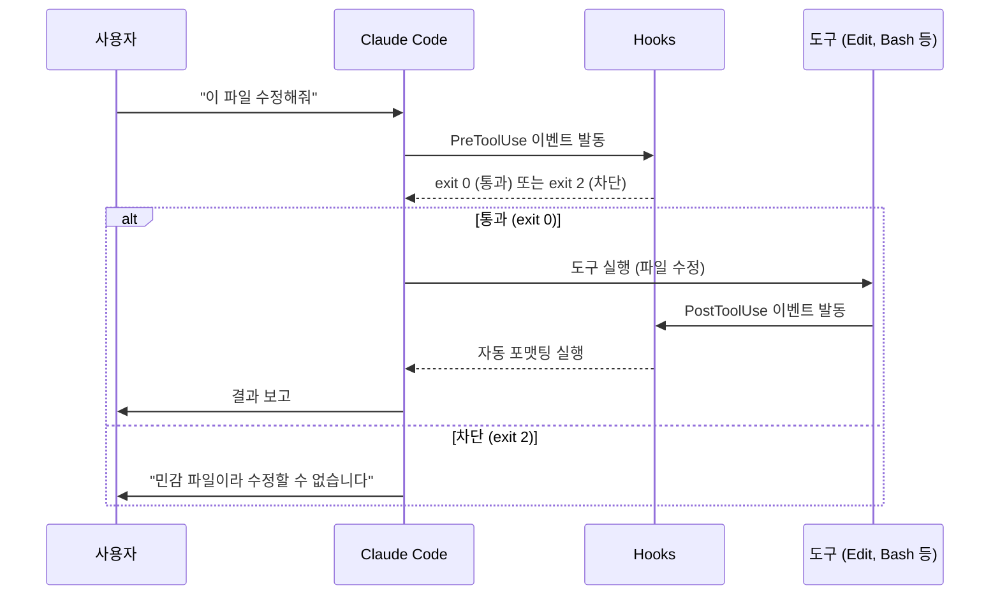

| 이벤트 | 언제? | 활용 예시 |
|--------|------|----------|
| **PreToolUse** | 도구 실행 **직전** | 민감 파일 수정 차단 |
| **PostToolUse** | 도구 실행 **직후** | 코드 자동 포맷팅 (prettier) |
| **Stop** | Claude 응답 완료 시 | 알림음 재생 |
| **Notification** | 알림 발생 시 | macOS 알림 팝업 |

### 실전 예시: 민감 파일 보호 Hook

```json
{
  "hooks": {
    "PreToolUse": [
      {
        "matcher": "Edit",
        "hooks": [
          {
            "type": "command",
            "command": "bash -c 'FILE=$(echo \"$TOOL_INPUT\" | jq -r \".file_path\"); if echo \"$FILE\" | grep -qE \"\\.(env|pem|key)$\"; then echo \"BLOCK: 민감 파일\" >&2; exit 2; fi'"
          }
        ]
      }
    ]
  }
}
```

### CLAUDE.md vs Hooks — 언제 뭘 쓰나?

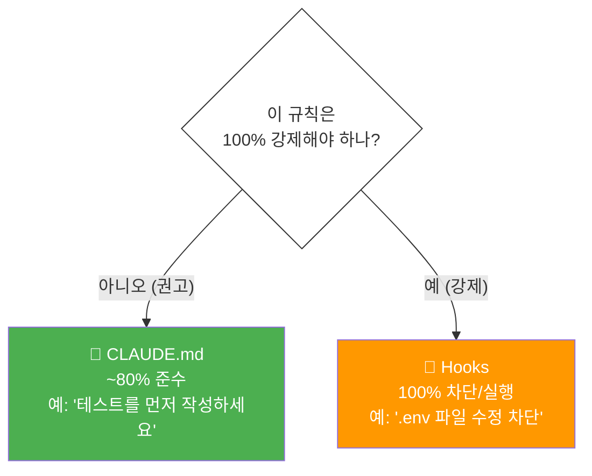

---

## 7. Skills — 반복 작업 자동화

Skills는 `/명령어`로 호출하는 자동화 레시피입니다.

### 파일 구조

```
~/.claude/skills/              ← 전역 (모든 프로젝트)
  commit-helper/
    SKILL.md

프로젝트/.claude/skills/       ← 프로젝트 전용
  deploy-check/
    SKILL.md
```

### SKILL.md 작성법

```yaml
---
name: commit-helper
description: 한국어 Conventional Commits 메시지 생성
allowed-tools:
  - Bash
  - Read
---

## 실행 절차

1. `git status`와 `git diff --staged`로 변경사항 파악
2. 최근 커밋 스타일 확인: `git log --oneline -5`
3. 한국어 + Conventional Commits 형식으로 메시지 작성
   - 예: `feat: 로그인 기능 추가`
4. `git commit` 실행
```

사용법: Claude Code에서 `/commit-helper` 입력

### 스킬 활용 흐름


---

## 8. 팀 공유 설정

### 팀원이 clone하면 자동 적용되는 구조

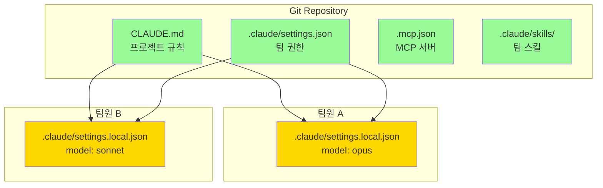

**원칙**:
- `git commit`하는 파일 = 팀 공유 (settings.json, CLAUDE.md, .mcp.json)
- `.gitignore`에 넣는 파일 = 개인용 (settings.local.json)

### 3계층 패턴 (대규모 팀)

조직 규모가 커지면 3계층으로 관리합니다:

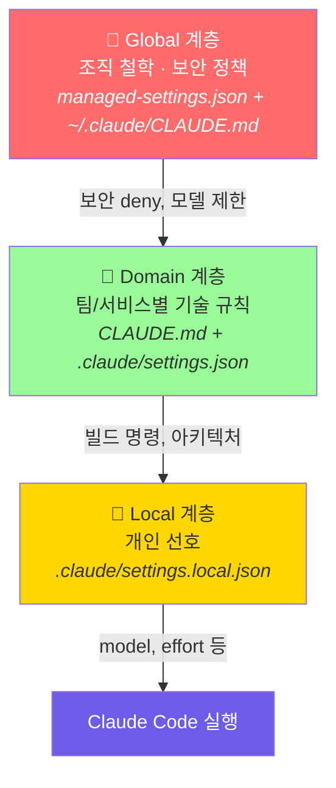

| 계층 | 역할 | 관리 주체 |
|------|------|----------|
| **Global** | 보안 정책, 금지 명령 | 보안팀/CTO |
| **Domain** | 프로젝트 규칙, 빌드 명령 | 팀 리드 |
| **Local** | 모델 선택, 개인 설정 | 개인 |

> 팀 온보딩 체크리스트는 [templates/team-onboarding-checklist.md](../templates/team-onboarding-checklist.md) 참조

---

## 9. CI/CD 연동

### 도입 순서 — 안전한 것부터


### GitHub Actions 예시 (가장 쉬움)

```yaml
# .github/workflows/claude-review.yml
name: Claude Code Review
on:
  pull_request:
    types: [opened, synchronize]

jobs:
  review:
    runs-on: ubuntu-latest
    steps:
      - uses: actions/checkout@v4
      - uses: anthropics/claude-code-action@v1
        with:
          anthropic_api_key: ${{ secrets.ANTHROPIC_API_KEY }}
          prompt: |
            이 PR을 다음 관점에서 리뷰하세요:
            1. 보안: SQL injection, XSS, 인증/인가 결함
            2. 성능: N+1 쿼리, 불필요한 연산
            3. 품질: 에러 핸들링, 테스트 누락
```

### Jenkins / GitLab CI

공식 Action이 없으므로 **Headless 모드**(`-p`)로 직접 호출합니다:

```bash
# Jenkins / GitLab CI 공통 패턴
npx @anthropic-ai/claude-code -p \
  "이 PR의 변경사항을 리뷰하세요." \
  --allowedTools "Read,Grep,Glob" \
  --output-format json > review.json
```

| 항목 | GitHub Actions | Jenkins | GitLab CI |
|------|:---:|:---:|:---:|
| 공식 Action | ✅ | ❌ CLI 직접 호출 | ❌ CLI 직접 호출 |
| PR 코멘트 자동 | ✅ 내장 | 수동 API | 수동 API |
| 설정 난이도 | 낮음 | 중간 | 중간 |

### Branch Protection — 필수!

Claude가 직접 main에 push하는 것을 **반드시 막아야** 합니다.

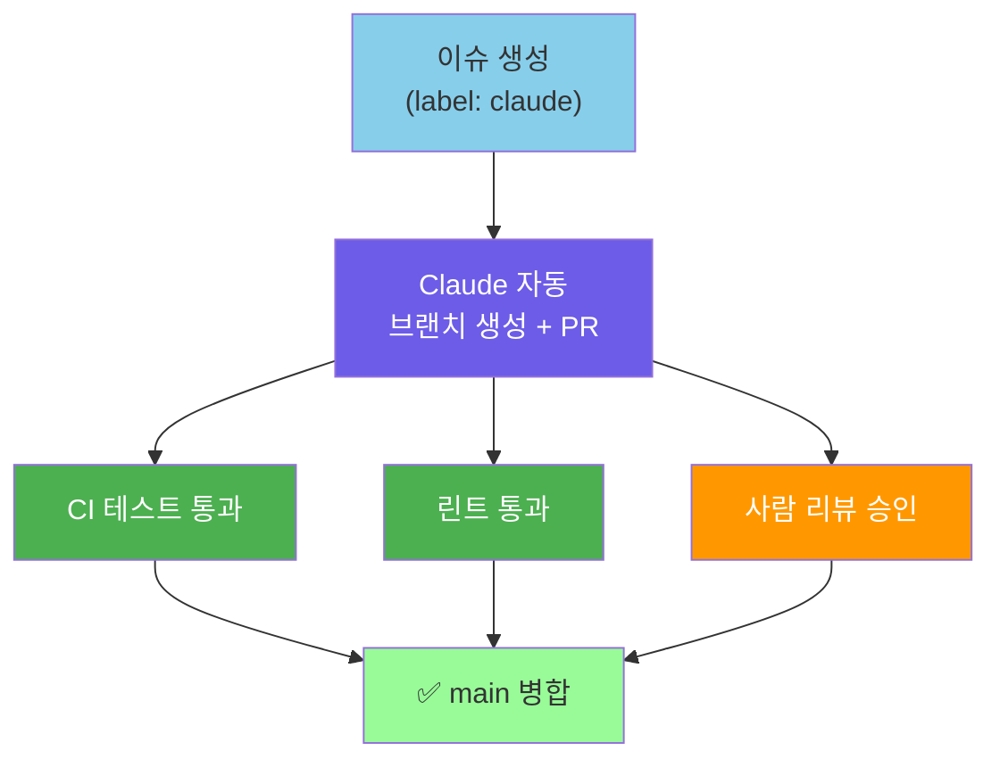

```json
// settings.json — force-push 원천 차단
{
  "permissions": {
    "deny": [
      "Bash(git push --force*)",
      "Bash(git push -f*)",
      "Bash(git push origin main*)"
    ]
  }
}
```

### 코드 리뷰 프로세스


---

## 10. 보안 필수 사항

### 최소 보안 체크리스트

| # | 항목 | 방법 |
|:-:|------|------|
| 1 | API 키 보호 | 환경변수·GitHub Secrets, 코드에 직접 넣지 않기 |
| 2 | 민감 파일 차단 | `deny` 규칙 + PreToolUse Hook |
| 3 | 위험 명령 차단 | `deny`에 `rm -rf`, `sudo` 등 등록 |
| 4 | 코드 전송 인지 | Claude 사용 시 코드가 API로 전송됨을 팀 공지 |
| 5 | 사람 리뷰 필수 | Branch Protection으로 자동 병합 방지 |

### 산업별 추가 고려사항

| 산업/규제 | 추가 요구사항 |
|----------|-------------|
| 금융 (전자금융감독규정) | 소스코드 외부 전송 승인 절차 |
| 의료 (개인정보보호법) | 환자 데이터 접근 원천 차단 |
| 공공 (클라우드 보안인증) | 국내 리전 API 사용 확인 |

> **중요**: Claude Code는 프롬프트와 코드를 Anthropic API로 전송합니다. 규제 환경에서는 보안팀과 사전 협의 후 도입하세요.

---

## 11. 팀 도입 로드맵

### 4주 플랜

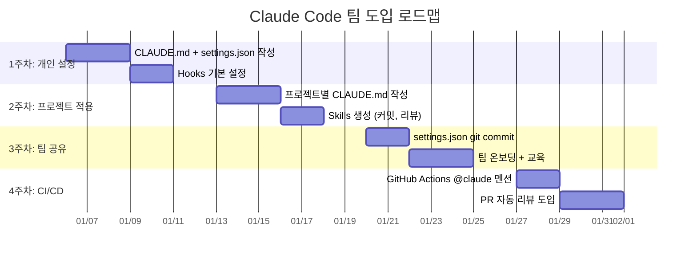

### 단계별 체크리스트

#### 1주차: 개인 설정

- [ ] Claude Code 설치 및 인증
- [ ] `~/.claude/CLAUDE.md` 작성 (언어, 커밋 스타일)
- [ ] `~/.claude/settings.json` 기본 deny 규칙 추가
- [ ] Stop/Notification Hook으로 알림 설정

#### 2주차: 프로젝트 적용

- [ ] 프로젝트 `CLAUDE.md` 작성 (빌드, 아키텍처, 주의사항)
- [ ] `.claude/settings.json` 프로젝트 권한 설정
- [ ] 자주 쓰는 작업을 Skills로 만들기

#### 3주차: 팀 공유

- [ ] `.claude/settings.json`을 git commit
- [ ] `.claude/settings.local.json`을 `.gitignore`에 추가
- [ ] 팀원 온보딩 (clone → 바로 사용 가능한지 확인)

#### 4주차: CI/CD

- [ ] GitHub Actions 워크플로우 1개 설정 (`@claude` 멘션)
- [ ] Branch Protection 규칙 활성화
- [ ] PR 자동 리뷰 테스트 실행
- [ ] `deny`에 force-push, `--no-verify` 차단 추가

---

## 전체 아키텍처 요약

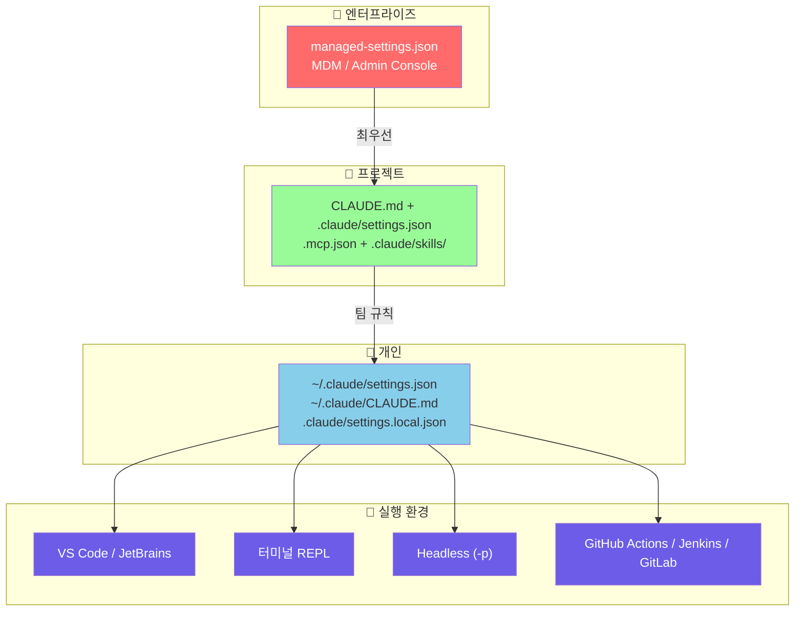

---

## Sources

- [Claude Code 공식 문서](https://code.claude.com/docs)
- [개인 설정 가이드](claude-code-개인설정-가이드.md) — settings.json, Hooks, Skills 상세
- [CLAUDE.md 실전 작성법](claude-code-CLAUDE-md-실전-작성법.md) — 프로젝트별 작성 패턴
- [Harness 추천 구성](claude-code-harness-추천구성.md) — Phase별 구성 전략
- [팀 IDE 통합 가이드](claude-code-팀-IDE-통합-가이드.md) — 팀 설정, CI/CD, Agent Teams
- [FAQ](claude-code-FAQ.md) — 자주 묻는 질문

---

## 직접 확인해보기

- [ ] Claude Code 설치 후 `claude --version`으로 확인
- [ ] `~/.claude/CLAUDE.md`에 개인 스타일 3줄 이상 작성
- [ ] 프로젝트 `CLAUDE.md`에 빌드 명령어와 주의사항 작성
- [ ] `deny` 규칙 1개 이상 설정 (예: `rm -rf` 차단)
- [ ] Hook 1개 설정 (예: Stop 알림음)
