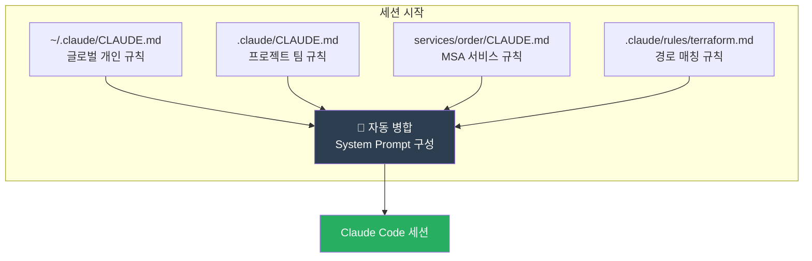
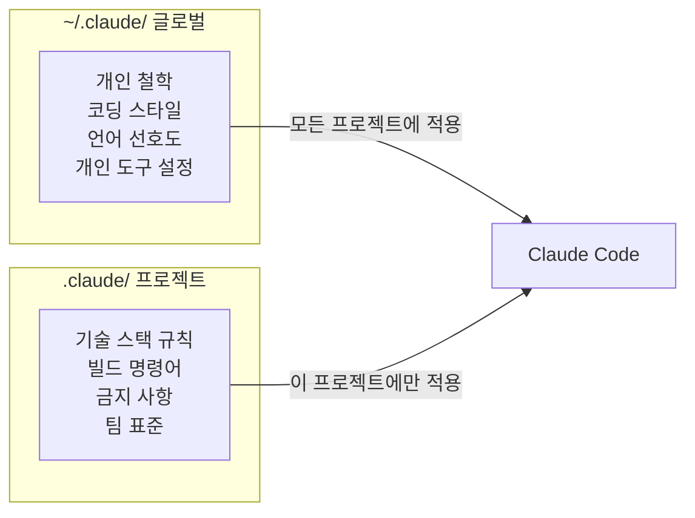
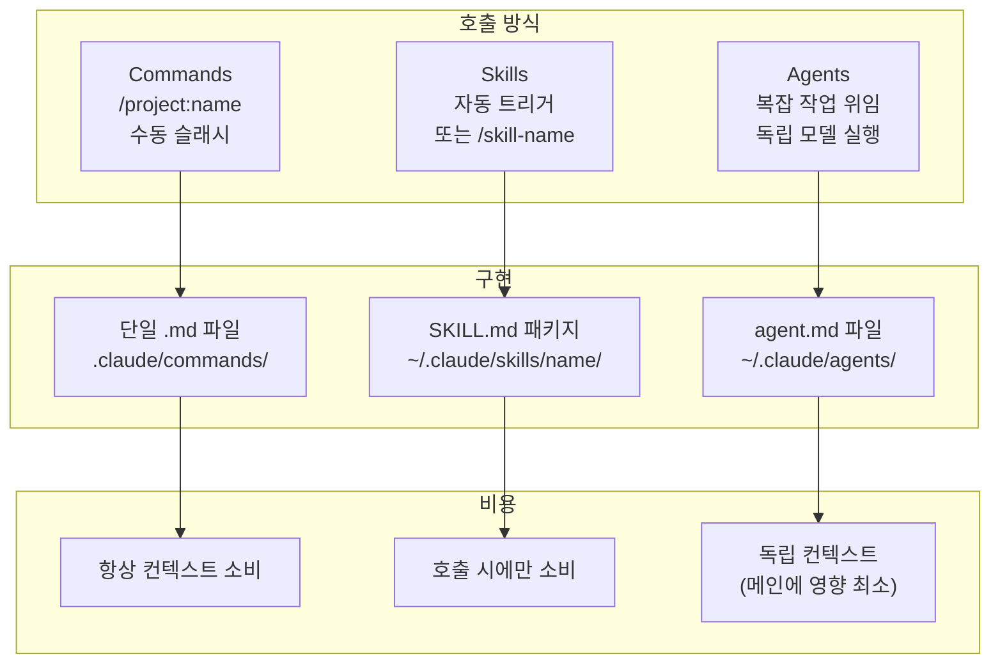
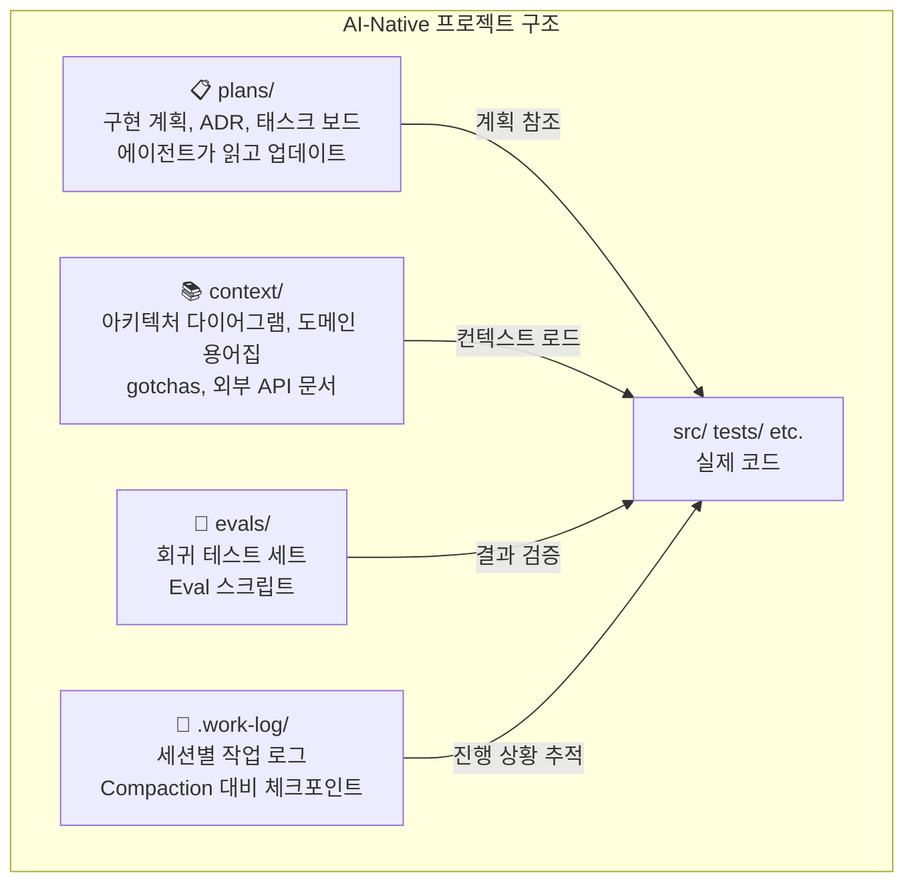

# .claude/ 통제센터 해부도

| 항목 | 날짜 |
|------|------|
| 생성일 | 2026-04-13 |
| 변경일 | 2026-04-13 |

> `.claude/` 디렉토리는 Claude Code의 두뇌가 아니라 **신경계**다.
> 이 가이드는 각 구성요소가 어떻게 연결되어 작동하는지 설명한다.

### 관련 문서
- [하네스 엔지니어링 방법론](claude-code-하네스-엔지니어링-방법론.md) — 이론적 기반 (4기둥, 결정론/확률론)
- [하네스 심화: 실패 패턴·참조 아키텍처·거버넌스](claude-code-하네스-심화-아키텍처.md) — 5가지 해부 요소, 상태 외부화, Stripe 6계층
- [개인 설정 가이드](claude-code-개인설정-가이드.md) — 각 구성요소 상세 구현
- [CLAUDE.md 실전 작성법](claude-code-CLAUDE-md-실전-작성법.md) — CLAUDE.md 작성 패턴

---

## 목차

1. [전체 구조](#1-전체-구조)
2. [컨텍스트 깔때기](#2-컨텍스트-깔때기)
3. [Global vs Project: 무엇을 어디에?](#3-global-vs-project-무엇을-어디에)
4. [Commands vs Skills vs Agents](#4-commands-vs-skills-vs-agents)
5. [rules/ 경로 기반 스코핑](#5-rules-경로-기반-스코핑)
6. [AI-Native 작업공간 구역 설계](#6-ai-native-작업공간-구역-설계)
7. [과잉설정 함정](#7-과잉설정-함정)
8. [참조 구현: claude-harness](#8-참조-구현-claude-harness)

---

## 1. 전체 구조

```
~/.claude/                          ← 글로벌 (개인, git 커밋 안 함)
├── CLAUDE.md                       ← 전체 프로젝트에 적용되는 개인 철학/규칙
├── settings.json                   ← 글로벌 권한 및 Hooks
├── agents/                         ← 재사용 가능한 서브에이전트
│   ├── planner.md
│   ├── architect.md
│   └── code-reviewer.md
├── skills/                         ← 호출 기반 자동화 레시피
│   ├── commit-helper/SKILL.md
│   ├── work-log/SKILL.md
│   └── ...
└── projects/                       ← Auto Memory (자동 기억)
    └── project-name/memory/

.claude/                            ← 프로젝트 (팀 공유, git 커밋)
├── CLAUDE.md                       ← 프로젝트별 기술 스택, 금지 사항
├── settings.json                   ← 프로젝트 권한 및 Hooks
├── settings.local.json             ← 개인 오버라이드 (gitignore)
└── rules/                          ← 경로 기반 스코프 규칙
    ├── terraform.md                 ← paths: terraform/**
    ├── k8s-deploy.md               ← paths: k8s/**
    └── ci-pipeline.md              ← paths: .github/**

CLAUDE.local.md                     ← 개인 오버라이드 (gitignore)
```

---

## 2. 컨텍스트 깔때기

세션 시작 시 Claude Code는 분산된 CLAUDE.md 파일들을 **자동으로 병합**하여 하나의 System Prompt를 구성한다.



**병합 우선순위 (낮은 번호가 더 강력):**

| 레벨 | 파일 위치 | 용도 | git 커밋 |
|------|----------|------|---------|
| 1 (최강) | Managed settings | 기업 강제 설정 | - |
| 2 | CLI 플래그 | 일회성 오버라이드 | - |
| 3 | `.claude/settings.local.json` | 개인 로컬 오버라이드 | ❌ |
| 4 | `.claude/settings.json` | 프로젝트 팀 설정 | ✅ |
| 5 (최약) | `~/.claude/settings.json` | 글로벌 개인 설정 | ❌ |

> **CLAUDE.md는 다르다**: settings.json은 우선순위로 오버라이드되지만,
> CLAUDE.md 파일들은 **모두 병합**된다 (오버라이드 아님).

**토큰 임팩트:** 각 CLAUDE.md 파일은 토큰을 소비한다. 글로벌 + 프로젝트 + 서브디렉토리가 모두 로드된다. 각 파일을 최소화할 이유가 여기에 있다.

---

## 3. Global vs Project: 무엇을 어디에?



| 내용 | 글로벌 `~/.claude/` | 프로젝트 `.claude/` |
|------|-------------------|--------------------|
| 언어 전략 (Korean/English) | ✅ | |
| 커밋 메시지 포맷 | ✅ | |
| 개인 코딩 스타일 | ✅ | |
| 빌드/테스트 명령어 | | ✅ |
| 기술 스택 특화 규칙 | | ✅ |
| 보안 경계 (민감 파일 목록) | 기본값 | 프로젝트 추가 |
| Hooks (파일 보호) | 글로벌 기본 | 프로젝트 특화 |

---

## 4. Commands vs Skills vs Agents

가장 혼란스러운 부분: 세 가지 자동화 메커니즘의 차이.



| 항목 | Commands | Skills | Agents |
|------|----------|--------|--------|
| **호출 방식** | `/project:name` (수동) | 조건 자동 트리거 또는 `/name` | 복잡한 요청 시 자동 선택 |
| **구현 위치** | `.claude/commands/` | `~/.claude/skills/name/` | `~/.claude/agents/` |
| **컨텍스트 비용** | 항상 소비 | 호출 시에만 | 독립 실행 |
| **모델** | 메인 모델 | 메인 모델 | 별도 지정 가능 (Haiku 등) |
| **적합한 용도** | 스크립트 결과 주입 | 반복 워크플로우 자동화 | 코드 리뷰, 보안 감사 |
| **예시** | `!gh issue view $ARG` 결과 주입 | commit-helper, work-log | code-reviewer, planner |

### 결정 기준

```
반복 워크플로우인가?
├── Yes: Skills 또는 Commands
│   └── 특정 조건에서 자동 실행?
│       ├── Yes → Skills (triggers 설정)
│       └── No → Commands (수동 /slash)
└── No: 복잡한 독립 분석/판단?
    ├── Yes → Agents (독립 실행, 결과 요약 반환)
    └── No → 그냥 Claude Code 직접 사용
```

---

## 5. rules/ 경로 기반 스코핑

`.claude/rules/` 디렉토리의 파일들은 **특정 파일 경로에서만 활성화**되는 규칙이다.

### 설정 방법

```markdown
<!-- .claude/rules/terraform.md -->
---
paths:
  - terraform/**
  - "*.tf"
  - "*.tfvars"
---

## Terraform 특화 규칙

- 모든 리소스에 필수 태그 추가: Environment, Owner, CostCenter
- `terraform destroy` 명령어 실행 전 반드시 Plan 결과 확인 요청
- 변수는 반드시 `variables.tf`에 선언, 인라인 사용 금지
- 출력값은 `outputs.tf`에 명시
```

### 장점

| 기존 방식 | rules/ 스코핑 |
|----------|--------------|
| 모든 규칙이 항상 로드됨 | 해당 파일 작업 시에만 로드 |
| CLAUDE.md 길어짐 | 각 영역 별도 파일로 관리 |
| 관련 없는 규칙이 컨텍스트 차지 | 필요한 규칙만 활성화 |

### 실전 예시

```
.claude/rules/
├── terraform.md          # paths: terraform/**, *.tf
├── k8s-deploy.md         # paths: k8s/**, **/deployment.yaml
├── ci-pipeline.md        # paths: .github/**, .gitlab-ci.yml
└── api-security.md       # paths: src/api/**, src/routes/**
```

---

## 6. AI-Native 작업공간 구역 설계

Claude Code와 함께 효율적으로 작업하기 위한 디렉토리 구조.



### 각 구역의 역할

**`plans/` — 에이전트와 공유하는 작업 계획:**
```markdown
# plans/feature-payment.md
## 현재 상태: IN PROGRESS
## 다음 단계: API 엔드포인트 구현
## 완료 조건: 통합 테스트 통과
```

**`context/` — 에이전트가 참조할 지식 베이스:**
```
context/
├── architecture.md       # 시스템 전체 구조도
├── domain-glossary.md    # 도메인 용어 정의
├── gotchas.md            # 함정과 주의 사항
└── external-apis.md      # 외부 API 명세
```

**`.work-log/` — 세션 체크포인트:**
```markdown
# .work-log/2026-04-13.md
## 14:30 - 결제 API 구현 완료
## 15:00 - 통합 테스트 3개 실패 중
## 다음 세션 시작점: PaymentService.java:142
```

### 기존 프로젝트에 도입하는 방법

```bash
# 최소 시작 (단계적 추가)
mkdir -p .work-log context plans

# context/ 에 현재 아키텍처 문서 이동
mv ARCHITECTURE.md context/architecture.md

# CLAUDE.md에 참조 추가
echo "## 프로젝트 컨텍스트\n- 아키텍처: context/architecture.md\n- 도메인 용어: context/domain-glossary.md" >> .claude/CLAUDE.md
```

> **상태 외부화 원칙**: AI 에이전트의 중요한 상태는 컨텍스트 창에 두지 말고 파일과 Git으로 외부화하라.
> 세션이 끝나도 `.work-log/`, `plans/`, `context/`에 저장된 상태는 남는다.
> 12-Factor App의 무상태 원칙을 역으로 적용한 패턴 — 상세: [하네스 심화 §3](claude-code-하네스-심화-아키텍처.md#3-상태-외부화-12-factor-app-원칙의-ai-적용)

---

## 7. 과잉설정 함정

하네스를 처음 접하면 모든 것을 설정하고 싶은 충동이 생긴다. 이것이 가장 위험하다.

### 증상

```
❌ 과잉설정 신호
- MCP 서버 10개 이상 활성화
- CLAUDE.md 300줄 초과
- Skills 20개 이상 설치
- Hooks 10개 이상 실행
- 매 세션마다 설정 관련 오류 발생
```

### 원인과 결과


### 해결: 최소 시작 → 반응적 추가

| 시기 | 행동 |
|------|------|
| 처음 시작 | MCP 0개, Skills 1-2개, Hooks 2-3개 |
| 불편함 발생 시 | 해당 불편함을 해결하는 것 하나만 추가 |
| 월 1회 | 사용하지 않는 것 제거 |
| 분기 1회 | 전체 구성 재평가 |

**기준 질문:**
> "이 설정을 삭제하면 Claude가 실수를 더 많이 할까?"
> No → 삭제하라.

---

## 8. 참조 구현: claude-harness

이 가이드의 모든 이론을 실전에 적용한 참조 구현이 `/Users/cjenm/poc/claude-harness`에 있다.

### 프로젝트 구조

```
claude-harness/
├── install.sh              ← 원커맨드 설치 (프로필 선택 지원)
├── base/
│   ├── CLAUDE.md           ← 팀 공통 규칙 (언어 전략, 커밋 포맷 등)
│   ├── settings.json       ← 글로벌 Hooks (파일 보호, 날짜 체크, 완료 사운드)
│   └── agents/             ← 3종 서브에이전트 (planner, architect, code-reviewer)
├── profiles/               ← 스택별 CLAUDE.md + Hooks
│   ├── backend-java/       ← Java 17+ / Spring Boot / JPA+MyBatis
│   ├── backend-spring/     ← Java 17+ / Spring Boot / JPA only
│   ├── backend-kotlin/     ← Kotlin 1.9+ / Spring Boot
│   ├── frontend/           ← React 18+ / Next.js 14+ / TypeScript
│   └── infra/              ← Docker / K8s / Terraform
├── skills/                 ← 7종 Skills (commit-helper, work-log, k8s-validator 등)
└── templates/              ← 수동 복사용 템플릿
```

### 설치 방법

```bash
git clone <repo-url> claude-harness
cd claude-harness

# 기본 설치 (글로벌 base + skills)
./install.sh

# 프로젝트 프로필 포함 설치
./install.sh --profile backend-java

# 업데이트 (기존 설정 백업 후 덮어쓰기)
./install.sh --update
```

### 포함된 Hooks 예시

**`base/settings.json` — 글로벌 3종 Hooks:**

```json
{
  "hooks": {
    "PreToolUse": [{
      "matcher": "Edit",
      "hooks": [{"type": "command", "command": "bash -c '...민감 파일 차단 로직...'"}]
    }],
    "PostToolUse": [{
      "matcher": "Edit",
      "hooks": [{"type": "command", "command": "bash -c '...변경일 자동 업데이트...'"}]
    }],
    "Stop": [{
      "hooks": [{"type": "command", "command": "afplay /System/Library/Sounds/Glass.aiff 2>/dev/null || true"}]
    }]
  }
}
```

**`profiles/infra/settings.json` — 위험 명령어 차단:**

```json
{
  "permissions": {
    "deny": [
      "Bash:kubectl delete*",
      "Bash:terraform destroy*",
      "Bash:terraform apply -auto-approve*",
      "Bash:helm uninstall*"
    ]
  }
}
```

### 이 가이드와의 관계

| 이 가이드 | claude-harness |
|----------|----------------|
| 4기둥 프레임워크 설명 | 실제 4기둥 구현 |
| 컨텍스트 깔때기 개념 | base/+profiles/+CLAUDE.md 계층 |
| Hooks=법률 개념 | settings.json hooks 구현 |
| Skills 재사용 패턴 | skills/ 7종 실전 예시 |
| 에스컬레이션 패턴 | code-reviewer 에이전트 |

> 이 저장소는 `claude-code-guides`의 이론을 실전에 구현한 예시다.
> 팀 도입 시 직접 설치하거나, 참고하여 팀에 맞게 커스터마이징하라.
