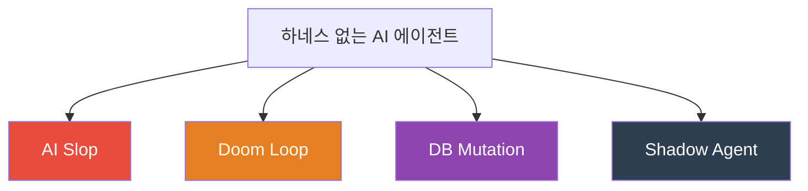
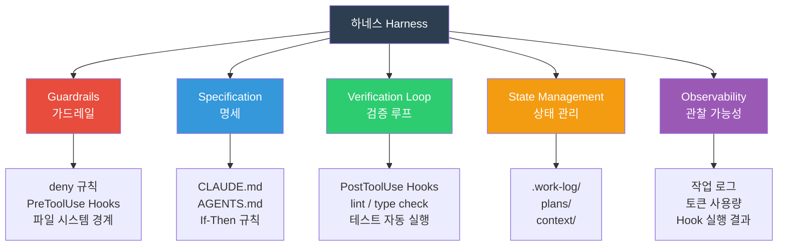
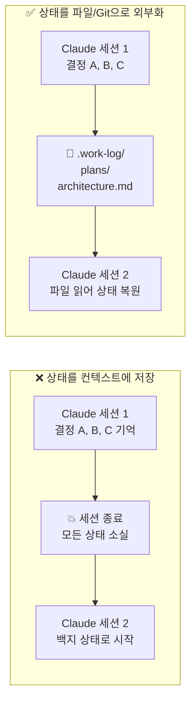
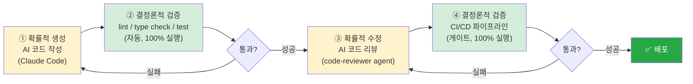
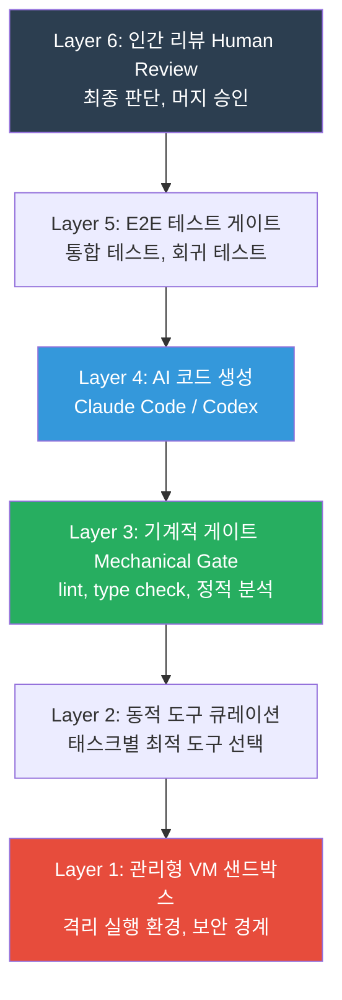
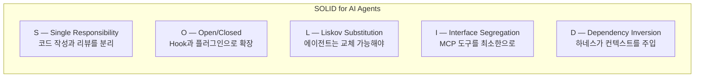
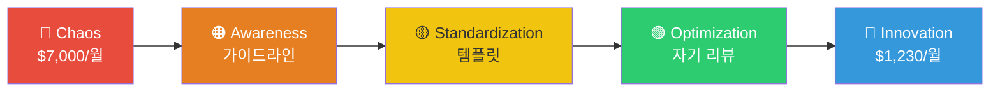

# 하네스 심화: 실패 패턴 · 참조 아키텍처 · 거버넌스

| 항목 | 날짜 |
|------|------|
| 생성일 | 2026-04-13 |
| 변경일 | 2026-04-13 |

> "에이전트와 싸우지 마라. 에이전트가 일할 수 있는 환경을 설계하라."
>
> 이 가이드는 하네스 엔지니어링의 심화 주제를 다룬다:
> 하네스 없을 때의 실패 패턴, 5가지 해부 요소, 참조 아키텍처, SOLID 재해석, 거버넌스 성숙도.

### 관련 문서
- [하네스 엔지니어링 방법론](claude-code-하네스-엔지니어링-방법론.md) — 4기둥, 결정론/확률론, 에스컬레이션 패턴
- [.claude/ 통제센터 해부도](claude-code-통제센터-해부도.md) — 디렉토리 구조 실전 설계
- [10단계 마스터리 로드맵](claude-code-10단계-마스터리-로드맵.md) — Eval, 컨텍스트 다이어트

---

## 목차

1. [하네스 없을 때의 4가지 실패 패턴](#1-하네스-없을-때의-4가지-실패-패턴)
2. [하네스의 5가지 해부 요소](#2-하네스의-5가지-해부-요소)
3. [상태 외부화: 12-Factor App 원칙의 AI 적용](#3-상태-외부화-12-factor-app-원칙의-ai-적용)
4. [하이브리드 워크플로우 사이클](#4-하이브리드-워크플로우-사이클)
5. [참조 아키텍처: Stripe 6계층 모델](#5-참조-아키텍처-stripe-6계층-모델)
6. [SOLID 원칙의 AI 에이전트 재해석](#6-solid-원칙의-ai-에이전트-재해석)
7. [거버넌스 성숙도 모델](#7-거버넌스-성숙도-모델)

---

## 1. 하네스 없을 때의 4가지 실패 패턴

하네스 없이 AI 에이전트를 쓰면 네 가지 치명적인 실패 패턴이 반복된다.



### 패턴 1: AI Slop (출력 오염)

**증상:** 그럴듯하지만 틀린 코드, 허구의 API, 잘못된 비즈니스 로직이 코드베이스에 쌓인다.

**원인:** 에이전트가 "맞는 것처럼 보이는 것"을 생성하는 데 최적화되어 있기 때문.
Guardrail(검증 게이트)이 없으면 틀린 코드가 그대로 병합된다.

**하네스 해결책:**
```json
// settings.json — PostToolUse로 타입 체크 강제
{
  "hooks": {
    "PostToolUse": [{
      "matcher": "Edit",
      "hooks": [{"type": "command", "command": "npx tsc --noEmit 2>&1 | head -20"}]
    }]
  }
}
```

### 패턴 2: Doom Loop (무한 루프)

**증상:** 에이전트가 같은 오류를 반복해서 "수정"하지만 실제로는 같은 자리를 맴돌고 있다. 30분 후에도 처음과 동일한 오류.

**원인:** 에이전트가 자신의 이전 시도 결과를 맥락으로 인식하지 못하거나, 테스트 없이 수정만 반복.

**하네스 해결책:**
```markdown
## CLAUDE.md — Doom Loop 방지 규칙

| 조건 (IF) | 행동 (THEN) |
|-----------|------------|
| 동일한 오류가 3회 반복 | 접근 방식을 바꾸고 사용자에게 보고 |
| 수정 후 테스트 없이 다음 수정 | 반드시 테스트 실행 후 결과 확인 |
| 10분 이상 같은 파일 반복 수정 | 중단하고 루트 원인 재분석 |
```

### 패턴 3: DB Mutation (데이터 파괴)

**증상:** 에이전트가 프로덕션 DB에 직접 `UPDATE`, `DELETE`, `DROP TABLE`을 실행. 데이터 소실.

**원인:** 파일 시스템 경계와 DB 접근 경계가 설정되지 않으면 에이전트는 할 수 있는 모든 것을 한다.

**하네스 해결책:**
```json
// settings.json — 위험 DB 명령어 차단
{
  "permissions": {
    "deny": [
      "Bash:*DROP TABLE*",
      "Bash:*DELETE FROM*",
      "Bash:*TRUNCATE*",
      "Bash:*UPDATE * SET*"
    ]
  }
}
```

```markdown
## CLAUDE.md — DB 접근 규칙

- DB 연결은 읽기 전용 계정만 사용
- 데이터 변경이 필요하면 마이그레이션 파일로 작성, 직접 실행 금지
- 프로덕션 DB URL은 절대 사용 금지 (개발 DB만 허용)
```

### 패턴 4: Shadow Agent (범위 초과)

**증상:** 요청한 것 이상을 수정한다. 파일 A를 고쳐달라고 했는데 파일 B, C, D까지 "개선"했고, 그 중 일부가 버그를 유발.

**원인:** 에이전트는 "연관되어 보이는 것"을 함께 수정하려는 경향이 있다. 파일 시스템 경계가 없으면 범위가 무제한으로 확장된다.

**하네스 해결책:**
```json
// settings.json — 수정 가능 경로 명시적 제한
{
  "permissions": {
    "allow": ["Edit:src/**", "Edit:tests/**"],
    "deny": ["Edit:config/**", "Edit:infra/**", "Edit:scripts/**"]
  }
}
```

```markdown
## CLAUDE.md — 범위 제한 규칙

- 요청받은 파일/모듈 외의 수정은 반드시 확인 후 진행
- 리팩토링은 명시적 요청 없이 수행 금지
- "연관되어 보이는" 것을 임의로 수정하지 말 것
```

---

## 2. 하네스의 5가지 해부 요소

[하네스 엔지니어링 방법론](claude-code-하네스-엔지니어링-방법론.md)의 4기둥이 **"무엇을 구축하는가"**를 다룬다면,
5가지 해부 요소는 **"하네스가 무엇으로 이루어져 있는가"**를 설명한다.



| 요소 | 역할 | 주요 구현체 |
|------|------|-----------|
| **Guardrails** | 위험 행동 사전 차단 | `deny` 규칙, `PreToolUse` Hooks |
| **Specification** | 에이전트 행동 규정 | CLAUDE.md, AGENTS.md, If-Then 테이블 |
| **Verification Loop** | 결과 자동 검증 | `PostToolUse` Hooks, lint, 테스트 |
| **State Management** | 세션 간 상태 보존 | `.work-log/`, `plans/`, `context/` |
| **Observability** | 에이전트 행동 투명화 | 작업 로그, 토큰 사용량, 승인 이력 |

### 4기둥 vs 5요소 비교

| 4기둥 (구축 관점) | 5요소 (구성 관점) |
|-----------------|-----------------|
| Runtime Constraints | Guardrails + Specification |
| System Enforcement | Verification Loop |
| Auto-Correction | Guardrails + Verification Loop |
| Evolutionary Cleaning | State Management + Observability |

---

## 3. 상태 외부화: 12-Factor App 원칙의 AI 적용

AI 에이전트의 가장 큰 약점은 **무상태(stateless)**다 — 세션이 끝나면 모든 기억이 사라진다.
12-Factor App의 무상태 원칙을 역으로 적용하면 이 문제를 해결할 수 있다.

### 12-Factor App "무상태" 원칙의 AI 역적용

12-Factor App은 애플리케이션이 상태를 메모리에 두지 말고 외부 저장소로 빼내라고 가르친다.
AI 에이전트에도 같은 원칙을 적용한다: **에이전트 내부(컨텍스트 창)에 상태를 두지 말고, 파일과 Git으로 외부화하라.**



### 상태 외부화 패턴

**패턴 1: 작업 진행 상태 → `.work-log/`**
```bash
# 세션 종료 전 반드시 실행
/work-log
# → .work-log/2026-04-13.md 에 현재 진행 상황 저장

# 다음 세션 시작 시
cat .work-log/2026-04-13.md | claude -p "이전 작업을 이어서 진행해줘"
```

**패턴 2: 아키텍처 결정 → ADR(Architecture Decision Record)**
```markdown
# context/adr/001-payment-service-split.md
## 결정: 결제 서비스를 별도 마이크로서비스로 분리
## 이유: 트랜잭션 격리 및 독립 배포 필요
## 영향: OrderService → PaymentService HTTP 호출로 변경
## 날짜: 2026-04-13
```

**패턴 3: 실패 패턴 → `context/gotchas.md`**
```markdown
# context/gotchas.md
## 주의 사항

| 상황 | 함정 | 올바른 방법 |
|------|------|-----------|
| Flyway 마이그레이션 | 기존 파일 수정 불가 | 반드시 새 버전 파일 생성 |
| JPA @Transactional | Service 레이어에만 | Repository 레이어 금지 |
| Docker 빌드 | M1 Mac ARM | `--platform linux/amd64` 필요 |
```

### Git History를 상태 저장소로 활용

```bash
# Claude가 항상 참조할 수 있도록 커밋 메시지를 결정 로그로 활용
git log --oneline -20 | claude -p "최근 변경 이력을 요약해서 현재 상태를 파악해줘"
```

> **핵심 원칙**: 에이전트의 기억 용량을 신뢰하지 마라.
> 중요한 상태는 항상 파일로 저장하고, Git으로 버전 관리하라.

---

## 4. 하이브리드 워크플로우 사이클

코드 생성부터 최종 배포까지 **확률적 단계와 결정론적 단계를 교대**하는 것이 핵심이다.



### 4단계 사이클 상세

| 단계 | 유형 | 실행 주체 | 실패 시 |
|------|------|----------|---------|
| ① 코드 생성 | 확률적 | Claude Code | 재생성 |
| ② 로컬 검증 | 결정론적 | PostToolUse Hooks | ①로 돌아감 |
| ③ 독립 리뷰 | 확률적 | code-reviewer 서브에이전트 | 수정 요청 |
| ④ CI/CD 게이트 | 결정론적 | 자동화 파이프라인 | PR 머지 차단 |

### 핵심 원칙

> **"AI는 결정론적 게이트를 절대 건너뛸 수 없다."**
>
> 확률적 단계(AI 생성, AI 리뷰)는 실수가 있을 수 있다.
> 결정론적 단계(lint, 타입 체크, 테스트, CI)는 실수가 없다.
> 두 단계를 교대시킴으로써 확률적 오류가 누적되지 않도록 한다.

### 실전 구현: PostToolUse 로컬 검증 Gate

```json
{
  "hooks": {
    "PostToolUse": [
      {
        "matcher": "Edit",
        "hooks": [
          {
            "type": "command",
            "command": "bash -c 'FILE=$(echo \"$TOOL_INPUT\" | jq -r \".file_path // empty\"); if [[ \"$FILE\" == *.ts || \"$FILE\" == *.tsx ]]; then npx tsc --noEmit 2>&1 | head -10; fi'"
          }
        ]
      }
    ]
  }
}
```

---

## 5. 참조 아키텍처: Stripe 6계층 모델

Stripe와 Anthropic이 독립적으로 수렴한 6계층 하네스 아키텍처.



### 계층별 역할

| 계층 | 유형 | Claude Code 구현체 |
|------|------|------------------|
| Layer 6: 인간 리뷰 | 확률적 | PR 리뷰, Vibe Review |
| Layer 5: E2E 테스트 | 결정론적 | CI/CD 파이프라인 |
| Layer 4: AI 생성 | 확률적 | Claude Code / code-reviewer agent |
| Layer 3: 기계적 게이트 | 결정론적 | PostToolUse Hooks (lint, tsc) |
| Layer 2: 도구 큐레이션 | 확률적 | Skills / MCP 선택적 로드 |
| Layer 1: 샌드박스 | 결정론적 | settings.json deny 규칙, 파일 경계 |

### 현실적 축소 버전 (팀 도입용)

Stripe의 완전한 구현은 인프라 투자가 크다. 팀 도입 시 현실적인 3계층부터 시작한다:

```
[인간] PR 리뷰 + Vibe Review
   ↑
[결정론] PostToolUse Hooks + CI (lint, tsc, test)
   ↑
[확률] Claude Code 코드 생성 + code-reviewer agent
```

---

## 6. SOLID 원칙의 AI 에이전트 재해석

소프트웨어 설계 원칙 SOLID를 AI 에이전트 하네스 설계에 적용하면 강력한 지침이 된다.



### S — 단일 책임: 코드 작성과 리뷰를 분리

> **"코드를 작성하는 에이전트와 리뷰하는 에이전트는 달라야 한다."**

같은 에이전트가 자신이 쓴 코드를 리뷰하면 블라인드 스팟이 생긴다.

```markdown
# .claude/agents/code-reviewer.md
---
name: code-reviewer
description: 독립적인 코드 리뷰어. 작성자와 분리된 관점.
tools: [Read, Grep, Glob]  # 수정 권한 없음
---
```

### O — 개방/폐쇄: Hook과 플러그인으로 확장

> **"기존 CLAUDE.md를 수정하지 않고, Hook과 Skills로 기능을 추가하라."**

```
확장 방법: 새 .claude/rules/ 파일 추가, 새 Skill 추가
수정 금지: 기존 작동하는 Hooks, 기존 settings.json deny 규칙
```

### I — 인터페이스 분리: MCP 도구 최소화

> **"에이전트에게 필요한 도구만 노출하라. 모든 도구를 다 주지 말 것."**

```json
// code-reviewer agent는 읽기 도구만
{
  "tools": ["Read", "Grep", "Glob"]
}

// deployment agent는 실행 도구만
{
  "tools": ["Bash", "Read"]
}
```

### D — 의존성 역전: 하네스가 컨텍스트를 주입

> **"에이전트가 컨텍스트를 찾아다니지 않도록, 하네스가 주입하라."**

```markdown
# CLAUDE.md — 컨텍스트 주입 선언
- 아키텍처: context/architecture.md 참조
- 도메인 용어: context/domain-glossary.md 참조
- 주의 사항: context/gotchas.md 참조
```

에이전트는 어디서 정보를 찾을지 스스로 결정하지 않는다. 하네스가 알려준다.

### SOLID 요약표

| 원칙 | AI 에이전트 적용 | 구현체 |
|------|----------------|--------|
| **S** 단일 책임 | 코드 작성 ≠ 코드 리뷰 | code-reviewer agent 분리 |
| **O** 개방/폐쇄 | Hook/Skills로 확장, 기존 설정 수정 최소화 | `.claude/rules/`, `skills/` 추가 |
| **L** 리스코프 치환 | 에이전트는 표준 인터페이스로 교체 가능 | `AGENTS.md` 표준 |
| **I** 인터페이스 분리 | 에이전트별 최소 도구만 노출 | agent frontmatter `tools:` |
| **D** 의존성 역전 | 하네스가 컨텍스트 주입 | CLAUDE.md에 참조 경로 선언 |

---

## 7. 거버넌스 성숙도 모델

팀의 AI 에이전트 운영 성숙도는 5단계로 진화한다.



### 5단계 상세

#### Level 1: Chaos (혼돈)
- **특징**: 팀원마다 다른 설정, 규칙 없음, AI 결과를 무조건 신뢰
- **비용**: 월 $7,000 (토큰 낭비 + 재작업 + 인시던트)
- **증상**: "AI가 내 코드를 망쳤어요", 매주 AI로 인한 버그

#### Level 2: Awareness (인식)
- **특징**: 팀 가이드라인 문서 존재, 그러나 개인별 적용 여부 다름
- **활동**: CLAUDE.md 기본 버전 공유, MCP 권장 목록 배포
- **한계**: 강제 메커니즘 없음, 가이드라인 무시 빈번

#### Level 3: Standardization (표준화)
- **특징**: 팀 공통 settings.json, 필수 Hooks 강제 적용
- **활동**: `install.sh` 원커맨드 설치, 프로필별 템플릿 배포
- **성과**: AI 인시던트 70% 감소, 코드 스타일 일관성

#### Level 4: Optimization (최적화)
- **특징**: code-reviewer agent, 분기별 하네스 재평가, Eval 세트 운영
- **활동**: 회귀 테스트 10-20개 유지, 독립 평가자 원칙 적용
- **성과**: 에이전트 품질 측정 가능, 지속적 개선 루프

#### Level 5: Innovation (혁신)
- **특징**: 하네스가 스스로 진화, AI가 하네스 개선 제안
- **비용**: 월 $1,230 (최적화로 82% 비용 절감)
- **성과**: AI가 전체 기능의 70%+ 담당, 인간은 방향성만 제공

### 비용 절감 데이터

| 항목 | Chaos | Innovation | 절감 |
|------|-------|-----------|------|
| 월 AI 비용 | $7,000 | $1,230 | -82% |
| AI 인시던트 | 주 3-5회 | 월 1회 이하 | -90%+ |
| 재작업 시간 | 주 10h+ | 주 1h | -90% |

### 현재 레벨 진단

```
□ Level 1: 팀원마다 CLAUDE.md가 다르거나 없다
□ Level 2: 공통 CLAUDE.md가 있지만 settings.json은 개인별로 다르다
□ Level 3: install.sh 또는 공통 설치 스크립트로 팀 표준 배포 중
□ Level 4: code-reviewer agent + Eval 회귀 세트를 운영 중
□ Level 5: 하네스 자체가 자동으로 진화하고 있다
```

**빠른 레벨업 방법:**

| 현재 레벨 | 다음 레벨로 가는 한 가지 행동 |
|----------|--------------------------|
| 1 → 2 | 팀 CLAUDE.md v1 작성 후 git 커밋 |
| 2 → 3 | settings.json deny 규칙 + protect-files hook 배포 |
| 3 → 4 | code-reviewer agent + 회귀 테스트 10개 구성 |
| 4 → 5 | 분기별 자동 하네스 재평가 + cost 측정 시작 |

---

## 요약

| 주제 | 핵심 메시지 |
|------|------------|
| 4가지 실패 패턴 | AI Slop, Doom Loop, DB Mutation, Shadow Agent — 모두 하네스로 예방 가능 |
| 5가지 해부 요소 | Guardrails + Specification + Verification Loop + State Management + Observability |
| 상태 외부화 | 중요한 상태는 파일/Git에 → 세션이 끝나도 사라지지 않는다 |
| 하이브리드 사이클 | 확률적 생성 → 결정론적 검증 → 확률적 수정 → 결정론적 검증 |
| Stripe 6계층 | 인간 리뷰 → E2E 테스트 → AI 생성 → 기계적 게이트 → 도구 큐레이션 → 샌드박스 |
| SOLID for AI | S(역할 분리), O(Hook 확장), I(도구 최소화), D(하네스가 컨텍스트 주입) |
| 거버넌스 성숙도 | Chaos($7K) → Innovation($1.2K) — 5단계, 82% 비용 절감 |
