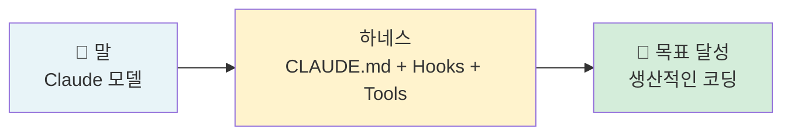
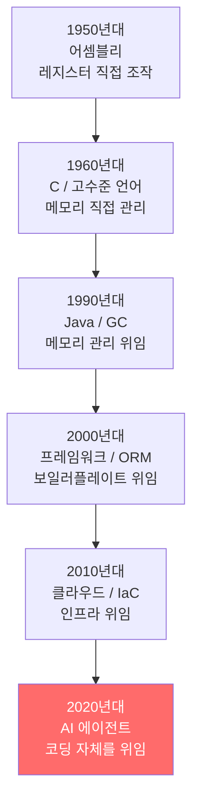
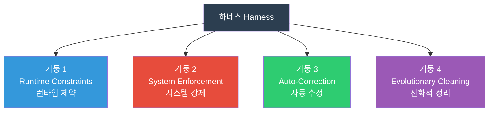
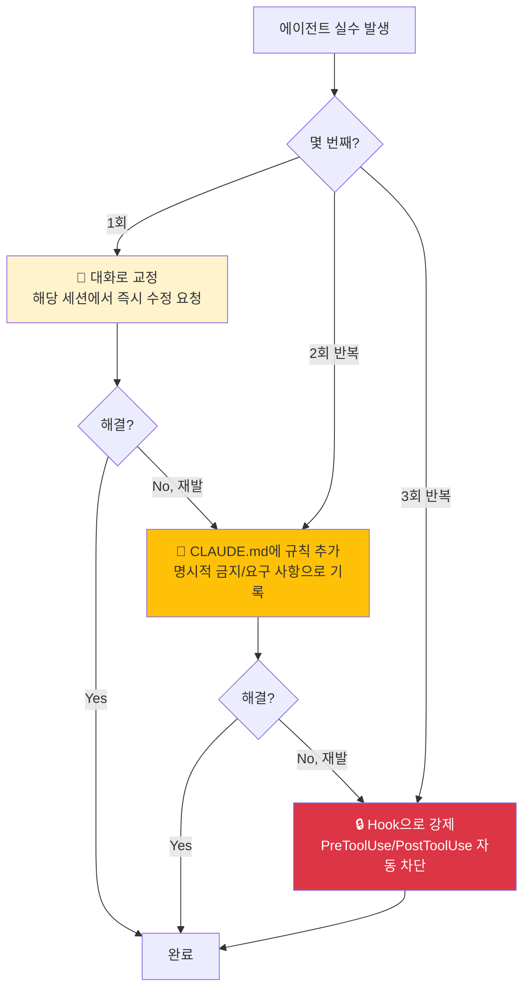
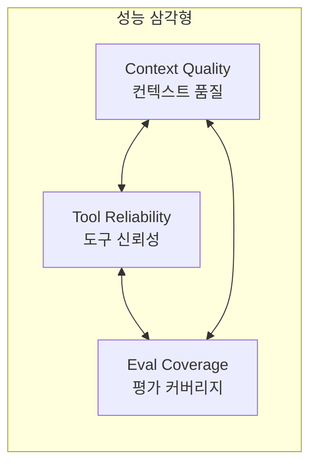
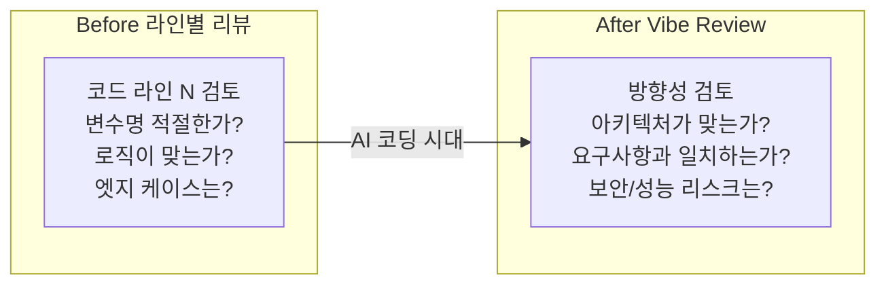
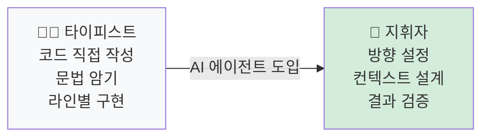

# Claude Code 하네스 엔지니어링 방법론

| 항목 | 날짜 |
|------|------|
| 생성일 | 2026-04-13 |
| 변경일 | 2026-04-13 |

> 프롬프트 엔지니어링의 시대는 끝났다. 이제 에이전트를 "설득"하는 대신 "통제"하는 시대다.
> 이 가이드는 Claude Code를 체계적으로 운용하기 위한 이론적 기반을 제공한다.

### 관련 문서
- [하네스 심화: 실패 패턴 · 참조 아키텍처 · 거버넌스](claude-code-하네스-심화-아키텍처.md) — 4가지 실패 패턴, 5요소, Stripe 6계층, SOLID for AI
- [Harness 추천 구성](claude-code-harness-추천구성.md) — 이 방법론의 실전 5단계 구현
- [개인 설정 가이드](claude-code-개인설정-가이드.md) — settings.json, Hooks, Skills 상세
- [10단계 마스터리 로드맵](claude-code-10단계-마스터리-로드맵.md) — 입문부터 숙달까지 학습 여정
- [.claude/ 통제센터 해부도](claude-code-통제센터-해부도.md) — 디렉토리 구조 실전 설계

---

## 목차

1. [하네스 엔지니어링이란?](#1-하네스-엔지니어링이란)
2. [소프트웨어 추상화의 역사](#2-소프트웨어-추상화의-역사)
3. [4기둥 프레임워크](#3-4기둥-프레임워크)
4. [결정론적 vs 확률적 통제](#4-결정론적-vs-확률적-통제)
5. [에스컬레이션 패턴](#5-에스컬레이션-패턴)
6. [3 성능 축](#6-3-성능-축)
7. [If-Then 규칙 엔진 패턴](#7-if-then-규칙-엔진-패턴)
8. [Vibe Review 패러다임](#8-vibe-review-패러다임)
9. [개발자 역할의 변화](#9-개발자-역할의-변화)

---

## 1. 하네스 엔지니어링이란?

### Agent = Model + Harness

```
Agent ≠ Model
Agent = Model + Harness
```

**모델**(Claude Sonnet/Opus)은 에이전트의 두뇌다. 그러나 두뇌만으로는 아무것도 할 수 없다.
**하네스(Harness)**는 모델이 아닌 모든 것 — 컨텍스트, 도구, 실행 루프, 검증, 제약 — 이다.

같은 Claude 모델을 쓰더라도 하네스 품질에 따라 결과물이 극적으로 달라진다.

> 성능의 병목은 모델 능력이 아니라 환경(하네스)이다.
> — Harness 벤치마크: 기준 점수 49.5 → 하네스 적용 후 79.3 (60% 향상)

### 말(Horse)과 하네스 비유



| 말 장비 | 하네스 구성요소 | 역할 |
|---------|----------------|------|
| 고삐 (Reins) | Prompt / CLAUDE.md | 방향 지시 |
| 안장 (Saddle) | Context + Tools | 능력 발휘 |
| 재갈 (Bridle) | Permissions + Hooks | 범위 제한 |

---

## 2. 소프트웨어 추상화의 역사

개발자가 직접 작성하는 것의 추상화 수준은 수십 년에 걸쳐 계속 올라왔다.



매번 "이건 너무 추상적이다"는 비판이 있었고, 매번 그 추상화가 표준이 되었다.

지금 우리는 코딩 자체를 위임하는 시대에 있다. 개발자의 역할은 **코드를 타이핑하는 것**에서 **에이전트가 일할 수 있는 환경(하네스)을 설계하는 것**으로 이동하고 있다.

---

## 3. 4기둥 프레임워크

하네스는 4개의 기둥으로 구성된다.



### 기둥 1: Runtime Constraints (런타임 제약)

에이전트가 실행되는 동안 지속적으로 적용되는 구조적 제약.

**구성요소:**
- `CLAUDE.md` — 코딩 규칙, 금지 사항, 프로젝트 컨텍스트 (에이전트가 항상 읽음)
- `settings.json` deny 규칙 — 특정 파일/명령어 접근 차단 (기술적 강제)
- `.claudeignore` — 토큰 낭비 파일 제외

**실전 예시:**
```json
// settings.json
{
  "permissions": {
    "deny": [
      "Edit:**/secrets/**",
      "Edit:**/.env*",
      "Bash:rm -rf*",
      "Bash:git push --force*"
    ]
  }
}
```

> 핵심: CLAUDE.md는 "요청"이고, deny 규칙은 "물리적 장벽"이다. deny 규칙은 에이전트가 무시할 수 없다.

### 기둥 2: System Enforcement (시스템 강제)

코드 작성 후 자동으로 실행되는 품질 게이트.

**구성요소:**
- PostToolUse Hooks — 파일 저장 후 lint/format 자동 실행
- Pre-commit hooks — 커밋 전 타입 체크, 테스트 실행
- CI/CD 게이트 — PR merge 전 필수 통과 조건

**실전 예시:**
```json
// settings.json hooks
{
  "hooks": {
    "PostToolUse": [{
      "matcher": "Edit",
      "hooks": [{
        "type": "command",
        "command": "cd $(git rev-parse --show-toplevel) && npx prettier --write ${file} 2>/dev/null || true"
      }]
    }]
  }
}
```

### 기둥 3: Auto-Correction & Boundaries (자동 수정 & 경계)

에이전트가 실수했을 때 자동으로 차단하거나 되돌리는 메커니즘.

**구성요소:**
- PreToolUse Hooks — 위험 작업 실행 전 차단 (exit code 2)
- 파일 시스템 경계 — `src/`는 읽기/쓰기, `config/`는 읽기 전용
- 브랜치 보호 — main 직접 push 차단

**실전 예시:**
```bash
#!/bin/bash
# PreToolUse hook: protect-files.sh
PROTECTED=(".env" ".env.local" ".pem" ".key" "secrets/")
FILE="${CLAUDE_TOOL_INPUT_FILE_PATH:-}"

for pattern in "${PROTECTED[@]}"; do
  if [[ "$FILE" == *"$pattern"* ]]; then
    echo "🚫 보호된 파일: $FILE" >&2
    exit 2  # exit 2 = Claude에게 차단 신호
  fi
done
```

### 기둥 4: Evolutionary Cleaning (진화적 정리)

시간이 지나면서 하네스 자체를 정기적으로 개선하는 프로세스.

**구성요소:**
- 월 1회 CLAUDE.md 리뷰 (불필요한 규칙 제거)
- 분기별 Skills/Agents 재평가 (사용되지 않는 것 제거)
- 에이전트가 자동으로 리팩토링 PR 생성 (중복/데드코드 탐지)

> "하네스의 목표는 점진적으로 스스로를 삭제하는 것이다."
> 모델이 성장할수록 인간이 수동으로 설정한 규칙의 필요성이 줄어든다.

---

## 4. 결정론적 vs 확률적 통제

하네스의 모든 구성요소는 두 범주 중 하나다.

```mermaid
graph LR
    subgraph 확률적 통제 Probabilistic
        A["CLAUDE.md<br/>코딩 가이드라인"]
        B["Prompt Instructions<br/>요청 사항"]
        C["AI Code Review<br/>아키텍처 판단"]
    end

    subgraph 결정론적 통제 Deterministic
        D["Hooks<br/>자동 실행"]
        E["deny 규칙<br/>기술적 차단"]
        F["Linter/Formatter<br/>100% 강제"]
    end

    style 확률적 통제 Probabilistic fill:#fff3cd
    style 결정론적 통제 Deterministic fill:#d4edda
```

| 구분 | 특성 | 용도 |
|------|------|------|
| **확률적 통제** | 유연, 무시 가능, 맥락 의존적 | 코딩 스타일, 아키텍처 판단, 복잡한 결정 |
| **결정론적 통제** | 100% 강제, 예외 없음, 자동 실행 | 보안 경계, 포맷팅, 필수 체크 |

**핵심 원칙:**
- 기계가 검증할 수 있는 것은 기계에게 맡겨라 (lint, type check, test)
- AI는 기계가 판단할 수 없는 것만 담당하라 (아키텍처, 비즈니스 로직)
- 두 범주를 혼용하지 말 것: Hooks로 코딩 스타일을 강제하거나, CLAUDE.md로 보안을 보장하려 하지 말 것

---

## 5. 에스컬레이션 패턴

에이전트가 반복적으로 같은 실수를 한다면 어떻게 대응해야 하는가?



> **"시스템을 고쳐라. 프롬프트가 아니라."**
>
> 에이전트가 규칙을 어길 때, 프롬프트를 더 정교하게 만드는 것은 해결책이 아니다.
> 구조적으로 그 실수가 불가능하도록 시스템을 설계하라.

### 실전 에스컬레이션 예시

| 상황 | 1단계 | 2단계 | 3단계 |
|------|-------|-------|-------|
| `.env` 파일 수정 시도 | "그 파일 건드리지 마세요" | CLAUDE.md에 `## 절대 금지` 섹션 추가 | `deny: Edit:**/.env*` + protect-files.sh hook |
| 커밋 메시지 한글 미작성 | 세션 내 재요청 | CLAUDE.md에 커밋 포맷 규칙 명시 | PostToolUse hook으로 자동 검증 |
| TypeScript `any` 사용 | 즉시 수정 요청 | `@typescript-eslint/no-explicit-any: error` 린트 규칙 | CI에서 타입 체크 필수 통과 조건으로 설정 |

---

## 6. 3 성능 축

Claude Code 운용 품질을 측정하는 3개의 독립적인 축.



### 축 1: Context Quality (컨텍스트 품질)

**정의:** 에이전트에게 제공하는 정보의 관련성, 완전성, 구조화 수준

| 지표 | 측정 방법 | 목표 |
|------|----------|------|
| CLAUDE.md 라인 수 | `wc -l` | 200줄 이하 |
| 규칙 유효성 | 월 1회 리뷰 | 오래된 규칙 제거 |
| 컨텍스트 활용률 | 세션당 `/compact` 빈도 | 낮을수록 좋음 |

**개선 방법:** "에이전트가 스스로 발견할 수 없는 것"만 포함. 코드에서 읽을 수 있는 것은 제외.

### 축 2: Tool Reliability (도구 신뢰성)

**정의:** 에이전트가 사용하는 도구(MCP, Skills, 명령어)의 성공률과 일관성

| 지표 | 측정 방법 | 목표 |
|------|----------|------|
| MCP 활성 서버 수 | `claude mcp list` | 5개 이하 권장 |
| Skills 성공률 | 수동 테스트 | 95% 이상 |
| Hooks 실행 성공률 | 로그 확인 | 100% |

**개선 방법:** "도구는 적을수록 강하다." 15개 MCP보다 2개 핵심 MCP가 정확도 높음.

### 축 3: Eval Coverage (평가 커버리지)

**정의:** 에이전트 결과물을 자동으로 검증하는 범위와 독립성

| 지표 | 측정 방법 | 목표 |
|------|----------|------|
| 자동화된 테스트 커버리지 | CI 리포트 | 핵심 경로 100% |
| 회귀 테스트 세트 | 실제 이슈 기반 | 10-20개 유지 |
| 독립 평가자 사용 | 별도 subagent | code-reviewer agent 분리 |

> **독립 평가자 원칙**: 에이전트가 자신의 코드를 스스로 리뷰하면 항상 좋은 점수를 준다.
> 별도의 `code-reviewer` 서브에이전트를 통해 독립적으로 검토하라.

---

## 7. If-Then 규칙 엔진 패턴

CLAUDE.md를 모호한 가이드라인 대신 **결정론적 규칙 테이블**로 작성하는 패턴.

### 안티패턴 vs 권장 패턴

**나쁜 예시 (모호한 지시):**
```markdown
## 코딩 스타일
- 좋은 코드를 작성하세요
- 적절한 에러 처리를 하세요
- 코드를 깨끗하게 유지하세요
```

**좋은 예시 (If-Then 규칙 테이블):**
```markdown
## 코딩 규칙 (If-Then)

| 조건 (IF) | 행동 (THEN) |
|-----------|------------|
| 함수가 30줄 초과 | 별도 함수로 분리 |
| try-catch 없는 외부 API 호출 | 반드시 에러 처리 추가 |
| 새 파일 생성 | 파일 상단에 1줄 목적 주석 추가 |
| TypeScript 타입 불확실 | `any` 대신 `unknown` + type guard |
| DB 쿼리 작성 | 파라미터 바인딩 필수, 문자열 연결 금지 |
| 새 라이브러리 추가 고려 | 기존 의존성으로 해결 가능한지 먼저 확인 |
```

### 규칙 작성 원칙

1. **조건은 명확하게** — "좋은 경우" X, "30줄 초과" O
2. **행동은 구체적으로** — "적절히 처리" X, "try-catch 추가" O
3. **예외 없이 적용** — 예외가 필요하면 규칙을 다시 설계
4. **줄 수 최소화** — If-Then 테이블 하나가 3단락 설명보다 낫다

---

## 8. Vibe Review 패러다임

AI 시대의 개발자 리뷰 방식 전환.



**Vibe Review의 핵심:**
- 라인별 코드 검토 → AI(code-reviewer 서브에이전트)에게 위임
- 개발자는 **방향성, 아키텍처, 비즈니스 요구사항 충족 여부**만 판단
- "이 코드가 맞는 방식으로 구현되었는가?" 대신 "이 기능이 올바른 방향으로 가고 있는가?"

**코드 리뷰 자동화 예시:**
```markdown
<!-- code-reviewer 서브에이전트 트리거 -->
/review: 이 PR에서 MUST-FIX, SHOULD-FIX, CONSIDER 분류로 리뷰해주세요.
보안 취약점과 아키텍처 위반 사항에 집중하세요.
```

---

## 9. 개발자 역할의 변화



| 역할 | 타이피스트 시대 | 지휘자 시대 |
|------|----------------|------------|
| 주요 활동 | 코드 작성 (80%), 설계 (20%) | 설계 (80%), 코드 검증 (20%) |
| 핵심 기술 | 언어 문법, 알고리즘 | 하네스 설계, 컨텍스트 엔지니어링 |
| 가치 창출 | 구현 속도 | 방향의 정확성 |
| AI와의 관계 | 도구 사용 | 협업 조율 |

### 시니어 개발자의 가치 증가

AI가 코딩을 대체할수록, 시니어 개발자의 가치는 **오히려 증가**한다.
이유: 올바른 방향을 설정하고, 결과를 판단하고, 하네스를 설계하는 것은
여전히 도메인 경험과 판단력을 필요로 하기 때문이다.

> "AI가 코딩 능력을 대체하는 게 아니다. AI가 코딩 능력의 가치를 낮추는 것이다.
> 그리고 동시에, 방향 설정 능력의 가치를 높이는 것이다."

---

## 요약

| 개념 | 핵심 메시지 |
|------|------------|
| Agent = Model + Harness | 하네스가 없으면 에이전트가 아니라 챗봇이다 |
| 4기둥 | Runtime Constraints → System Enforcement → Auto-Correction → Evolutionary Cleaning |
| 결정론/확률론 분리 | 기계로 검증 가능한 것은 Hooks으로, 판단이 필요한 것은 CLAUDE.md로 |
| 에스컬레이션 패턴 | 1회=대화, 2회=CLAUDE.md, 3회=Hook |
| If-Then 규칙 엔진 | 모호한 가이드라인 → 명확한 조건-행동 테이블 |
| Vibe Review | 라인 리뷰는 AI에게, 방향 판단은 개발자에게 |

다음 단계: **[Harness 추천 구성](claude-code-harness-추천구성.md)**에서 이 방법론을 5단계로 실전 적용하는 방법을 확인하라.
